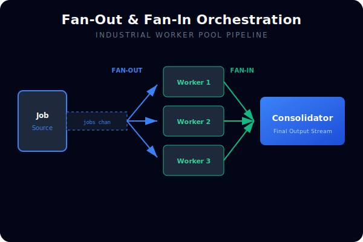
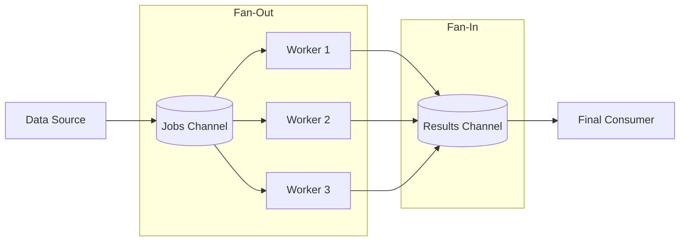

# [BK-02-CH-01] Fan-In & Fan-Out

**Industrial-Scale Concurrent Orchestration**
*Target: Memahami pola distribusi beban kerja dan konsolidasi hasil dalam waktu < 4 menit.*

## 1. Definisi & Konsep (The Logic)

**Fan-Out** adalah pola di mana sebuah channel tunggal dibaca oleh banyak worker (goroutine) untuk memproses data secara paralel. Ini sangat efektif untuk tugas-tugas berat (CPU-bound atau I/O-bound).

**Fan-In** adalah pola sebaliknya, di mana banyak channel (biasanya output dari para worker) dikonsolidasikan menjadi satu channel tunggal untuk diproses lebih lanjut secara sekuensial.

### Terminologi Utama (Senior Terms)
- **Worker Pool**: Kumpulan goroutine tetap yang menunggu pekerjaan untuk menghindari overhead pembuatan goroutine berulang kali.
- **Multiplexing**: Proses menggabungkan beberapa aliran data menjadi satu aliran (inti dari Fan-In).
- **Poison Pill**: Sinyal khusus (biasanya penutupan channel) untuk memerintahkan semua worker berhenti.

## 2. Rasionalitas (Why & How?)

Mengapa menggunakan pola ini?
- **Throughput**: Memanfaatkan seluruh CPU Core yang tersedia (`GOMAXPROCS`).
- **Resource Limiting**: Dengan membatasi jumlah worker, Anda mencegah aplikasi "meledak" karena terlalu banyak membuat koneksi atau memori.
- **Sequential Consolidation**: Memastikan hasil dari banyak worker yang selesai di waktu berbeda dapat dikumpulkan dengan rapi.

### Mekanisme Kerja Under-the-Hood
1. **Fan-Out**: Satu channel (Jobs) diteruskan ke `n` goroutine. `select` atau `for-range` pada channel yang sama secara otomatis melakukan distribusi beban (maupun tidak merata, tapi aman).
2. **Fan-In**: Menggunakan `sync.WaitGroup` untuk menunggu semua worker selesai, lalu menutup channel hasil (Results), atau menggunakan `select` di atas slice of channels.

## 3. Implementasi Utama (The Lab)

Lihat orkestrasi beban kerja di [examples/](./examples/).
1. `01-industrial-worker-pool`: Pola lengkap Pipeline -> Fan-Out (Workers) -> Fan-In (Consolidator).

## 4. Model Mental Visual (The Assets)

### Fan-Out/Fan-In Flow

---
*Back to [SR-03 Page](../README.md)*
