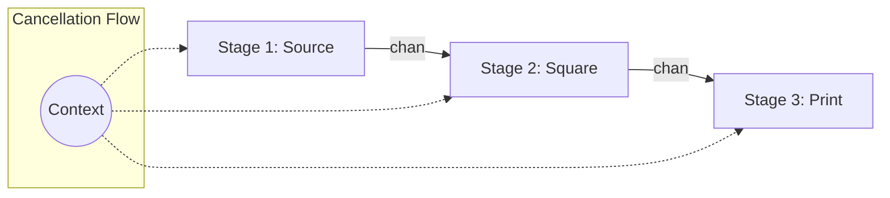

# [BK-02-CH-02] Pipeline Orchestration

**Context-Aware Multi-Stage Processing**
*Target: Memahami cara mengelola aliran data antar tahap secara aman dan terkontrol dalam waktu < 4 menit.*

## 1. Definisi & Konsep (The Logic)

**Pipeline** adalah serangkaian tahap (stages) di mana setiap tahap mengambil input dari channel, melakukan operasi, dan mengirimkan output ke channel berikutnya.

**Orchestration** dalam konteks ini adalah pengelolaan lifecycle seluruh pipeline, terutama bagaimana menghentikan seluruh tahap secara serentak jika terjadi error atau timeout menggunakan **`context.Context`**.

### Terminologi Utama (Senior Terms)
- **Pipeline Stage**: Fungsi yang menerima `<-chan` (read-only) dan mengembalikan `<-chan` baru.
- **Context Propagation**: Meneruskan sinyal pembatalan (`ctx.Done()`) ke setiap goroutine di setiap tahap pipeline.
- **Graceful Teardown**: Memastikan tidak ada goroutine yang "bocor" (running forever) setelah pipeline selesai atau dibatalkan.

## 2. Rasionalitas (Why & How?)

Mengapa butuh orchestrasi formal?
- **Decoupling**: Setiap tahap pipeline hanya tahu cara memproses datanya sendiri, tidak peduli dari mana asal data atau ke mana tujuannya.
- **Error Propagation**: Jika tahap kedua gagal, tahap pertama dan ketiga harus tahu untuk berhenti membersihkan resource.
- **Memory Safety**: Tanpa pembatalan yang jelas, goroutine pengirim bisa terblokir selamanya (Deadlock) jika penerimanya sudah berhenti.

### Mekanisme Kerja Under-the-Hood
1. Setiap fungsi tahap menerima parameter `ctx context.Context`.
2. Di dalam setiap loop pemrosesan, gunakan `select` untuk mengecek `case <-ctx.Done():`.
3. Gunakan `defer close(out)` pada setiap tahap untuk memastikan aliran data hilir (downstream) tahu kapan stream berakhir.

## 3. Implementasi Utama (The Lab)

Lihat teknik pemrosesan berantai di [examples/](./examples/).
1. `01-multistage-pipeline`: Pipeline 3 tahap (Source -> Square -> Print) dengan pembatalan via Context.

## 4. Model Mental Visual (The Assets)

### Pipeline Stages with Context

---
*Back to [SR-03 Page](../README.md)*
