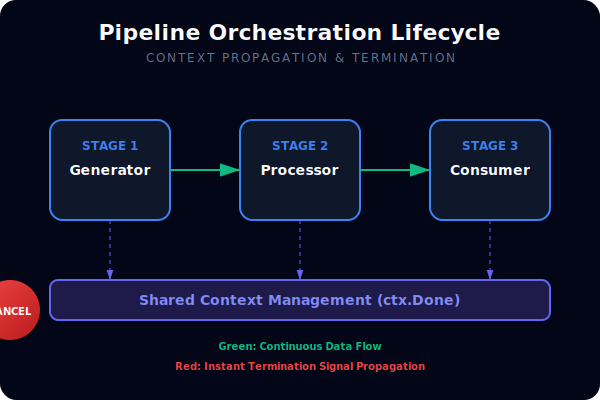
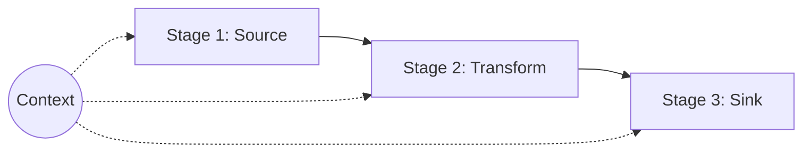

# CH-02: Pipeline Orchestration

## 1. Tahap 1: Source Alignment dan Judul

- **Source Link**: [Go Concurrency Patterns: Pipelines and cancellation](https://go.dev/blog/pipelines) | [context package](https://pkg.go.dev/context)
- **Framing**: Pipeline yang bagus bukan cuma soal memindahkan data antar stage, tapi juga soal tahu kapan seluruh aliran harus berhenti agar tidak meninggalkan goroutine yang bocor.

## 2. Tahap 2: Konsep dan Rasionalitas

### Definisi
Pipeline adalah rangkaian stage yang menerima input dari channel, memprosesnya, lalu mengirim hasil ke channel berikutnya. Orchestration berarti mengatur lifecycle seluruh stage, terutama cancellation, shutdown, dan penutupan channel yang benar.

### Rasionalitas
Pola ini dipilih karena:

1. **Setiap stage jadi fokus pada satu tugas**  
   Source, transform, dan sink bisa dipisah agar perubahan di satu titik tidak merusak semua alur.
2. **Cancellation bisa dipropagasikan dengan jelas**  
   Saat timeout atau error terjadi, seluruh stage bisa berhenti bersama.
3. **Goroutine leak lebih mudah dicegah**  
   Channel dan context dipakai sebagai kontrak lifecycle, bukan hanya alat kirim data.

### Analogi Model Mental
Bayangkan jalur produksi bertahap di pabrik. Tiap meja punya tugas sendiri, tetapi semua meja juga terhubung ke satu tombol stop darurat. Kalau ada masalah di satu tahap, seluruh jalur bisa dihentikan dengan rapi.

### Terminologi Teknis
- **Pipeline Stage**: fungsi yang membaca dari channel input lalu mengembalikan channel output.
- **Context Propagation**: meneruskan sinyal berhenti ke semua stage melalui `context.Context`.
- **Graceful Teardown**: penghentian aliran kerja tanpa meninggalkan worker yang menggantung.

## 3. Tahap 3: Visualisasi Sistem

## 4. Tahap 4: Mekanisme Pembuktian

Di praktik Go, tiap stage biasanya:
- menerima `ctx context.Context`;
- menulis ke output channel sendiri;
- menutup output itu saat selesai;
- memeriksa `ctx.Done()` agar bisa berhenti lebih awal.

Model ini membuat pembatalan tidak tersebar ke banyak flag manual. Begitu ada timeout atau kondisi gagal, aliran berhenti dari satu sumber kontrol yang sama.

## 5. Tahap 5: Lab Praktis

Lihat pembuktian di folder [examples/](./examples):
- [01-multistage-pipeline](./examples/01-multistage-pipeline) - Pipeline tiga tahap dengan cancellation berbasis `context.Context`.

---
*Status: [x] Complete*
