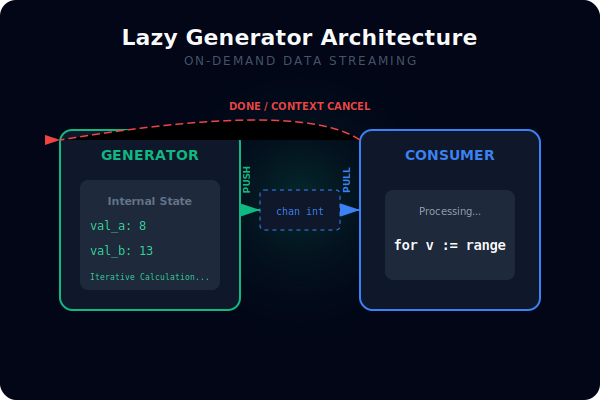
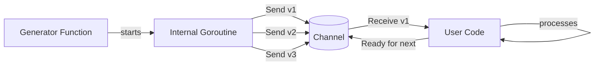

# [BK-02-CH-03] Generator Patterns

**Lazy Sequence & Memory-Efficient Streaming**
*Target: Memahami cara menghasilkan aliran data secara on-demand dalam waktu < 4 menit.*

## 1. Definisi & Konsep (The Logic)

**Generator** adalah fungsi yang menghasilkan urutan nilai (sequence) dan mengirimkannya melalui channel. Konsumen dapat membaca nilai tersebut satu per satu ("lazy") tanpa harus menunggu seluruh urutan dibuat di dalam memori (slice).

### Terminologi Utama (Senior Terms)
- **Lazy Evaluation**: Menghitung nilai hanya saat dibutuhkan oleh konsumen.
- **Infinite Streams**: Generator yang tidak pernah berhenti mengirim data (misal: ID Generator atau Heartbeat).
- **Closure-based Generator**: Menggunakan closure untuk mempertahankan *state* internal antar iterasi.

## 2. Rasionalitas (Why & How?)

Mengapa menggunakan Generator daripada return Slice?
- **Memory Efficiency**: Jika Anda menghasilkan 10 juta angka, menyimpannya dalam `[]int` akan memakan ratusan MB RAM. Generator hanya memakan ruang untuk satu nilai pada satu waktu.
- **Responsiveness**: Konsumen bisa mulai memproses data pertama segera setelah dihasilkan, tanpa menunggu data ke-10 juta selesai dibuat.
- **Decoupling Production & Consumption**: Memungkinkan produsen data berjalan di goroutine terpisah dengan kecepatan yang berbeda dari konsumen (menggunakan buffering jika perlu).

### Mekanisme Kerja Under-the-Hood
1. Fungsi generator membuat channel.
2. Memulai goroutine yang menjalankan loop produksi.
3. Mengembalikan channel tersebut sebagai `<-chan` (read-only) ke pemanggil.
4. Penting: Selalu sediakan mekanisme `done` atau `context` agar generator tidak bocor jika konsumen berhenti membaca lebih awal.

## 3. Implementasi Utama (The Lab)

Lihat pola penghasil data efisien di [examples/](./examples/).
1. `01-lazy-seq`: Implementasi generator angka Fibonacci sebagai aliran data tak terbatas (infinite) yang dikontrol via context.

## 4. Model Mental Visual (The Assets)

### Generator Output Stream

---
*Back to [SR-03 Page](../README.md)*
