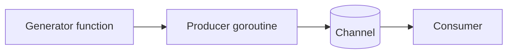

# CH-03: Generator Patterns

## 1. Tahap 1: Source Alignment dan Judul

- **Source Link**: [Go Concurrency Patterns: Pipelines and cancellation](https://go.dev/blog/pipelines) | [Effective Go: Channels](https://go.dev/doc/effective_go#channels)
- **Framing**: Generator berguna saat data tidak perlu dibentuk sekaligus di memori, melainkan bisa dihasilkan sedikit demi sedikit sesuai kebutuhan konsumen.

## 2. Tahap 2: Konsep dan Rasionalitas

### Definisi
Generator adalah fungsi yang menghasilkan aliran nilai melalui channel, biasanya dengan bantuan goroutine. Nilai dikirim satu per satu sehingga konsumen bisa memprosesnya secara lazy.

### Rasionalitas
Pola ini dipilih karena:

1. **Memori lebih hemat**  
   Data besar tidak harus ditampung penuh dalam slice sebelum mulai diproses.
2. **Konsumen bisa mulai lebih cepat**  
   Nilai pertama bisa dipakai segera, tanpa menunggu seluruh urutan selesai dibuat.
3. **Produksi dan konsumsi jadi lebih longgar keterikatannya**  
   Produsen dan konsumen bisa berjalan dengan ritme berbeda selama kontrak channel-nya jelas.

### Analogi Model Mental
Bayangkan mesin tiket yang mencetak nomor antrean saat orang datang. Mesin tidak mencetak sejuta tiket di awal. Ia hanya membuat tiket baru saat memang ada yang meminta.

### Terminologi Teknis
- **Lazy Evaluation**: nilai baru dihitung saat dibutuhkan.
- **Infinite Stream**: aliran yang secara teori tidak punya akhir tetap.
- **Cancellation Signal**: mekanisme berhenti agar generator tidak bocor ketika konsumen selesai lebih dulu.

## 3. Tahap 3: Visualisasi Sistem

## 4. Tahap 4: Mekanisme Pembuktian

Generator biasanya membuat channel, lalu menjalankan goroutine yang mengirim nilai ke channel tersebut. Tantangan utamanya bukan hanya "menghasilkan data", tetapi juga "berhenti dengan rapi" saat konsumen tidak lagi membaca. Karena itu, pola generator yang sehat sering dipasangkan dengan `context.Context` atau sinyal done channel.

Nilai praktisnya:
- cocok untuk stream nilai yang panjang atau tak terbatas;
- memperkecil alokasi memori besar yang sebenarnya belum tentu langsung dibutuhkan;
- membantu engineer memisahkan logika produksi data dari logika konsumsi data.

## 5. Tahap 5: Lab Praktis

Lihat pembuktian di folder [examples/](./examples):
- [01-lazy-seq](./examples/01-lazy-seq) - Generator Fibonacci berbasis channel yang menunjukkan pola lazy streaming dengan kontrol cancellation.

---
*Status: [x] Complete*
