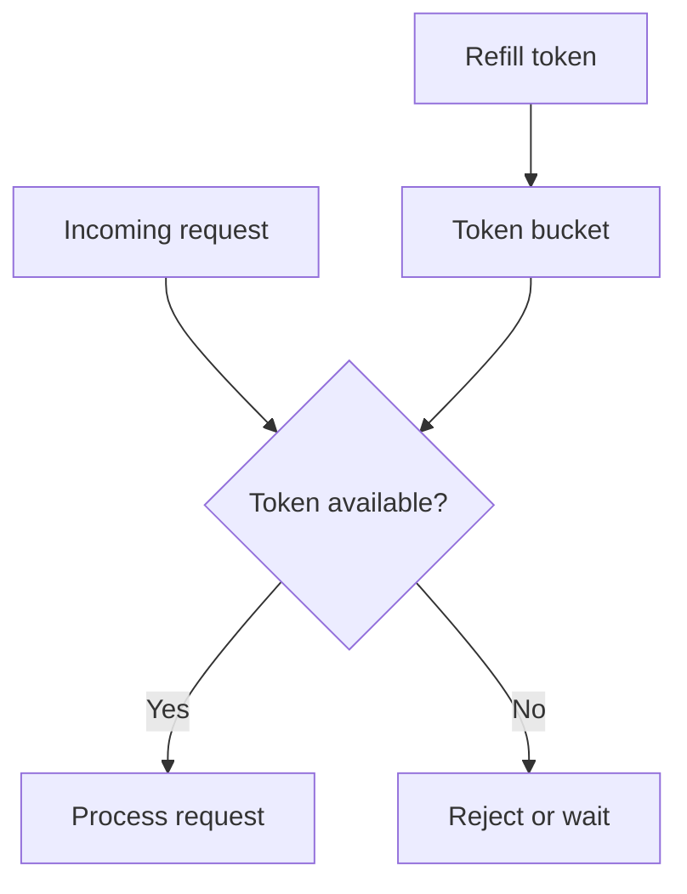

# CH-01: Rate Limiting

## 1. Tahap 1: Source Alignment dan Judul

- **Source Link**: [golang.org/x/time/rate](https://pkg.go.dev/golang.org/x/time/rate)
- **Framing**: Rate limiting dipakai saat sistem perlu tetap waras di bawah lonjakan traffic, bukan sekadar membatasi request secara asal.

## 2. Tahap 2: Konsep dan Rasionalitas

### Definisi
Rate limiting adalah teknik untuk mengatur seberapa cepat request atau operasi boleh lewat. Di Go, pola yang paling umum adalah **token bucket**, di mana token diisi berkala dan tiap request harus "membayar" satu token.

### Rasionalitas
Pola ini dipilih karena:

1. **Sistem tidak gampang overload**  
   Database, API downstream, atau worker pool tidak langsung tumbang saat ada lonjakan trafik.
2. **Burst masih bisa diizinkan secara terukur**  
   Token bucket memberi ruang untuk ledakan kecil tanpa membuka pintu lebar-lebar.
3. **Kontrol flow jadi eksplisit**  
   Engineer bisa memilih apakah request ditolak cepat atau menunggu giliran.

### Analogi Model Mental
Bayangkan pintu masuk venue dengan gelang akses terbatas. Orang bisa masuk selama masih ada gelang tersisa. Kalau gelang habis, mereka harus menunggu stok baru atau ditolak.

### Terminologi Teknis
- **Token Bucket**: model limiter berbasis token yang diisi ulang berkala.
- **Burst Capacity**: jumlah token maksimum yang boleh menumpuk.
- **Backpressure**: tekanan yang memaksa produsen menunggu atau melambat.

## 3. Tahap 3: Visualisasi Sistem

## 4. Tahap 4: Mekanisme Pembuktian

Paket `golang.org/x/time/rate` memberi limiter yang menyimpan state jumlah token dan waktu refill. Method seperti `Allow()` cocok untuk penolakan cepat, sedangkan `Wait()` cocok saat sistem lebih baik menahan laju daripada langsung menolak.

Nilai praktisnya:
- menjaga service tetap stabil saat trafik naik;
- memberi engineer kontrol antara throughput dan fairness;
- mencegah resource penting dipakai habis oleh segelintir request yang datang bersamaan.

## 5. Tahap 5: Lab Praktis

Lihat pembuktian di folder [examples/](./examples):
- [01-token-bucket](./examples/01-token-bucket) - Simulasi limiter sederhana berbasis `x/time/rate` untuk menunjukkan perilaku burst dan pembatasan laju.

---
*Status: [x] Complete*
