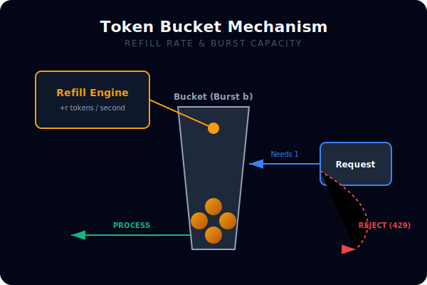
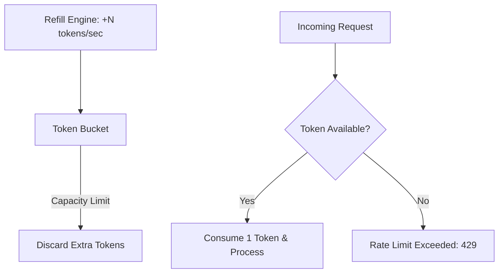

# [BK-03-CH-01] Rate Limiting

**System Resilience & Flow Control**
*Target: Memahami cara melindungi sistem dari overload permintaan dalam waktu < 4 menit.*

## 1. Definisi & Konsep (The Logic)

**Rate Limiting** adalah teknik untuk mengontrol kecepatan masuknya permintaan atau operasi dalam sistem. Tujuannya adalah memastikan sistem tetap stabil (Resilient) meskipun terjadi lonjakan trafik (Traffic Spikes) atau serangan DDoS.

### Terminologi Utama (Senior Terms)
- **Token Bucket**: Algoritma di mana token ditambahkan ke "ember" secara berkala. Permintaan hanya diproses jika ada token tersedia. Mendukung *burstiness*.
- **Leaky Bucket**: Algoritma di mana permintaan masuk ke antrian dan keluar (diproses) dengan kecepatan tetap yang stabil.
- **Burst Capacity**: Jumlah maksimum permintaan yang boleh diproses secara instan dalam satu waktu singkat.

## 2. Rasionalitas (Why & How?)

Mengapa butuh Rate Limiting di level aplikasi?
- **Resource Protection**: Mencegah database atau API downstream tumbang karena terlalu banyak request.
- **Fairness**: Memastikan satu pengguna/client tidak menghabiskan seluruh kuota resource sistem (Noisy Neighbor problem).
- **Cost Control**: Menghindari pembengkakan biaya jika menggunakan layanan cloud berbasis pay-per-request.

### Mekanisme Kerja Under-the-Hood
Di Go, Rate Limiter standar diimplementasikan dalam paket `golang.org/x/time/rate`.
1. **`Limit`**: Kecepatan regenerasi token per detik.
2. **`Burst`**: Ukuran maksimum ember (bucket).
3. **`Allow()`**: Mengecek apakah ada token, jika tidak ada langsung return `false` (non-blocking).
4. **`Wait()`**: Menunggu hingga token tersedia (blocking).

## 3. Implementasi Utama (The Lab)

Lihat proteksi API di [examples/](./examples/).
1. `01-token-bucket**: Simulasi API middleware yang membatasi request per detik menggunakan `x/time/rate`.

## 4. Model Mental Visual (The Assets)

### Token Bucket Logic

---
*Back to [SR-03 Page](../README.md)*
