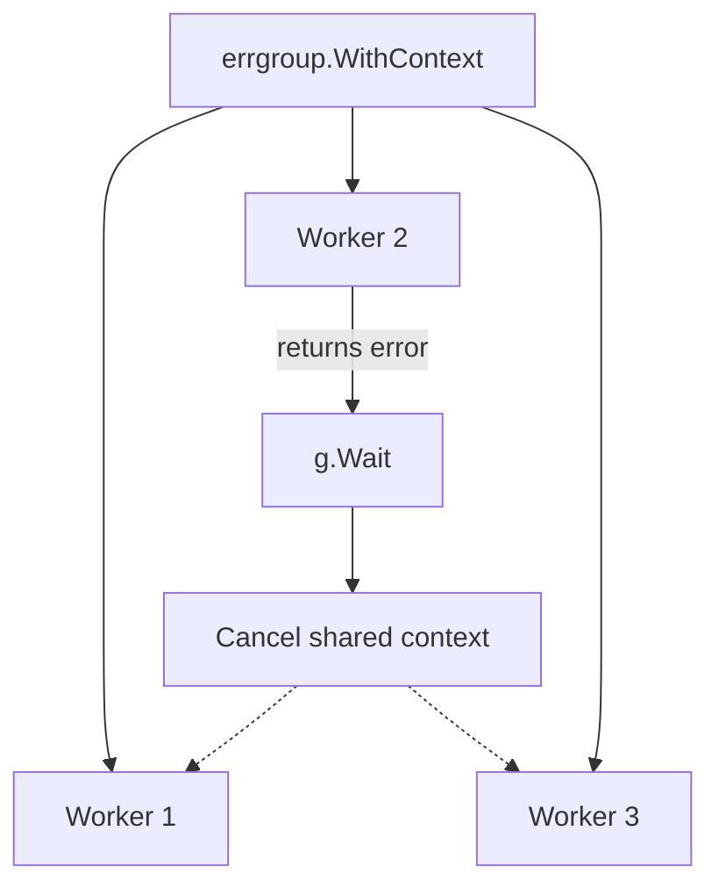

# CH-02: `errgroup` for Concurrent Error Handling

## 1. Tahap 1: Source Alignment dan Judul

- **Source Link**: [golang.org/x/sync/errgroup](https://pkg.go.dev/golang.org/x/sync/errgroup) | [context package](https://pkg.go.dev/context)
- **Framing**: `errgroup` berguna saat banyak goroutine harus bergerak bersama, dan kegagalan satu goroutine seharusnya menghentikan pekerjaan yang lain.

## 2. Tahap 2: Konsep dan Rasionalitas

### Definisi
`errgroup` adalah helper untuk menjalankan beberapa goroutine sebagai satu grup kerja. Ia mengumpulkan error pertama yang muncul dan, bila dipakai dengan context, membantu membatalkan pekerjaan lain secara terkoordinasi.

### Rasionalitas
Pola ini dipilih karena:

1. **Boilerplate koordinasi jadi lebih kecil**  
   Engineer tidak perlu merakit `WaitGroup`, error channel, dan cancellation manual untuk kasus umum.
2. **Failure handling lebih tegas**  
   Begitu satu tugas gagal, grup bisa langsung berhenti tanpa membuang kerja tambahan.
3. **Context integration sudah alami**  
   Sinyal berhenti mudah diteruskan ke semua worker.

### Analogi Model Mental
Bayangkan tim teknisi yang sedang menangani satu insiden. Kalau satu orang menemukan bahwa sumber masalah membutuhkan shutdown total, anggota lain tidak perlu lanjut kerja seolah semua baik-baik saja.

### Terminologi Teknis
- **Short-Circuit**: menghentikan grup lebih awal saat satu jalur gagal.
- **Error Propagation**: meneruskan error dari worker ke pemanggil utama.
- **Shared Context**: context yang dipakai bersama agar pembatalan konsisten.

## 3. Tahap 3: Visualisasi Sistem

## 4. Tahap 4: Mekanisme Pembuktian

Dengan `errgroup.WithContext`, setiap worker menerima context turunan yang akan di-cancel saat ada error pertama. Ini membuat penghentian grup tidak perlu diatur dengan banyak sinyal terpisah. `g.Wait()` lalu menjadi satu titik sinkronisasi sekaligus tempat menerima error utama.

Nilai praktisnya:
- cocok untuk fetch paralel, fan-out task, atau batch operasi yang punya nasib bersama;
- mencegah goroutine lain terus bekerja saat hasil akhirnya sudah pasti gagal;
- membuat koordinasi concurrency lebih ringkas dan lebih aman.

## 5. Tahap 5: Lab Praktis

Lihat pembuktian di folder [examples/](./examples):
- [01-parallel-fetch](./examples/01-parallel-fetch) - Beberapa fetch paralel yang memakai `errgroup` untuk short-circuit saat satu jalur gagal.

---
*Status: [x] Complete*
