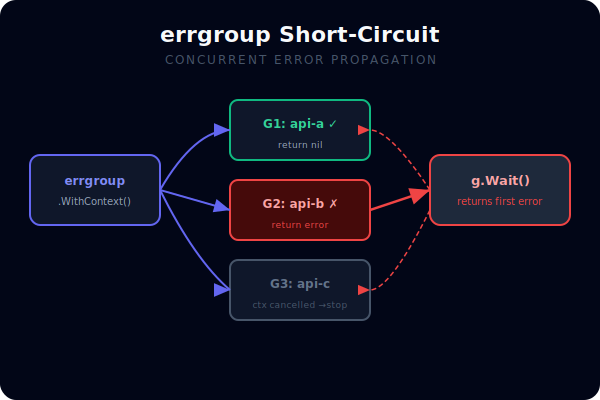
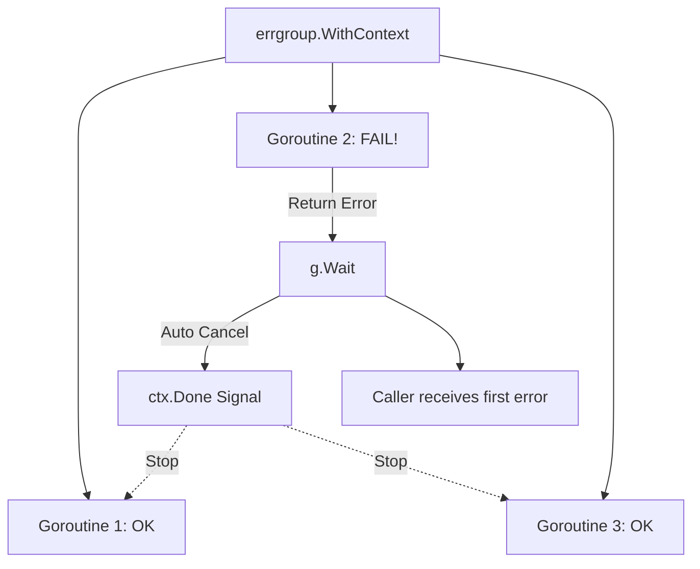

# [BK-03-CH-02] Concurrent Error Handling (errgroup)

**WaitGroups on Steroids**
*Target: Memahami cara mengelola banyak goroutine dan menangkap error pertama yang muncul dalam waktu < 4 menit.*

## 1. Definisi & Konsep (The Logic)

**`errgroup`** (dari paket `golang.org/x/sync/errgroup`) adalah grup goroutine yang bekerja bersama untuk menyelesaikan subtugas. Berbeda dengan `sync.WaitGroup` standar, `errgroup` secara otomatis menangkap error pertama yang dikembalikan oleh salah satu goroutine dan membatalkan goroutine lain dalam grup tersebut.

### Terminologi Utama (Senior Terms)
- **Error Propagation**: Proses meneruskan error dari worker ke thread utama secara otomatis.
- **Short-Circuiting**: Menghentikan seluruh grup segera setelah satu worker gagal.
- **Group Context**: Context yang secara otomatis di-cancel jika salah satu goroutine mengembalikan error.

## 2. Rasionalitas (Why & How?)

Mengapa menggunakan `errgroup` daripada `sync.WaitGroup` + channel error manual?
- **Simplicity**: Mengurangi boilerplate untuk menangani slice of errors atau channel buffer.
- **Safety**: Satu tahap gagal, sisa tahap tidak berjalan sia-sia (mencegah pemborosan CPU/IO).
- **Context Integration**: Mudah digabungkan dengan `context.WithCancel` untuk pembatalan kaskade.

### Mekanisme Kerja Under-the-Hood
1. Buat grup: `g, ctx := errgroup.WithContext(mainCtx)`.
2. Picu goroutine: `g.Go(func() error { ... })`.
3. Tunggu: `err := g.Wait()`.
4. Jika ada error, `g.Wait()` mengembalikan **error pertama** yang terjadi, context otomatis di-cancel.

## 3. Implementasi Utama (The Lab)

Lihat orkestrasi error yang elegan di [examples/](./examples/).
1. `01-parallel-fetch`: Mengambil data dari banyak sumber secara paralel; kegagalan satu sumber membatalkan semua.

## 4. Model Mental Visual (The Assets)

### errgroup Short-Circuit Logic

---
*Back to [BK-03 Page](../README.md)*
