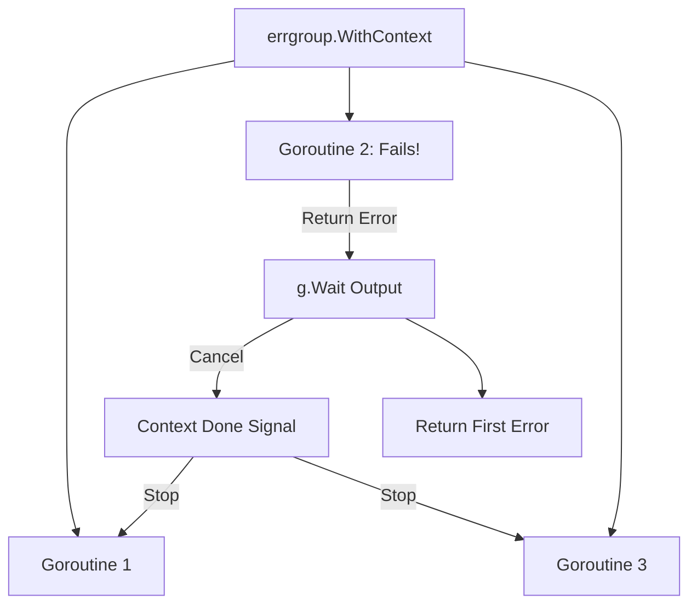

# [BK-03-CH-02] Concurrent Error Handling (errgroup)

**WaitGroups on Steroids**
*Target: Memahami cara mengelola banyak goroutine dan menangkap error pertama yang muncul dalam waktu < 4 menit.*

## 1. Definisi & Konsep (The Logic)

**`errgroup`** (dari paket `golang.org/x/sync/errgroup`) adalah grup goroutine yang bekerja bersama untuk menyelesaikan subtugas. Berbeda dengan `sync.WaitGroup` standar, `errgroup` secara otomatis menangkap error pertama yang dikembalikan oleh salah satu goroutine dan membatalkan (cancel) goroutine lain yang tersisa dalam grup tersebut.

### Terminologi Utama (Senior Terms)
- **Error Propagation**: Proses meneruskan error dari worker ke thread utama (manager) secara otomatis.
- **Short-Circuiting**: Menghentikan seluruh grup segera setelah satu worker gagal, untuk menghemat resource.
- **Group Context**: Context yang secara otomatis ditutup (`Done`) jika salah satu goroutine dalam grup mengembalikan error.

## 2. Rasionalitas (Why & How?)

Mengapa menggunakan `errgroup` daripada `sync.WaitGroup` + channel error manual?
- **Simplicity**: Mengurangi boilerplate code untuk menangani slice of errors atau channel buffer.
- **Safety**: Menjamin bahwa jika satu tahap gagal, sisa tahap lainnya tidak akan berjalan sia-sia (mencegah pemborosan CPU/IO).
- **Context Integration**: Sangat mudah digabungkan dengan `context.WithCancel` untuk pembatalan kaskade.

### Mekanisme Kerja Under-the-Hood
1. Anda membuat grup dengan `g, ctx := errgroup.WithContext(mainCtx)`.
2. Anda memicu goroutine dengan `g.Go(func() error { ... })`.
3. Anda menunggu hasil dengan `err := g.Wait()`.
4. Jika ada satu atau lebih error, `g.Wait()` akan mengembalikan error pertama yang terjadi.

## 3. Implementasi Utama (The Lab)

Lihat orkestrasi error yang elegan di [examples/](./examples/).
1. `01-parallel-fetch`: Mengambil data dari banyak API secara paralel, di mana kegagalan satu API akan membatalkan semua fetch lainnya.

## 4. Model Mental Visual (The Assets)

### errgroup Short-Circuit logic

---
*Back to [SR-03 Page](../README.md)*
