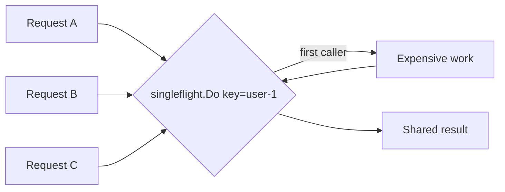

# CH-03: `singleflight` and Duplicate Request Coalescing

## 1. Tahap 1: Source Alignment dan Judul

- **Source Link**: [golang.org/x/sync/singleflight](https://pkg.go.dev/golang.org/x/sync/singleflight)
- **Framing**: `singleflight` dipakai saat banyak request identik datang bersamaan, dan sistem perlu memastikan kerja mahal hanya dieksekusi sekali.

## 2. Tahap 2: Konsep dan Rasionalitas

### Definisi
`singleflight` adalah mekanisme untuk menggabungkan request duplikat berdasarkan key. Saat satu goroutine sedang mengerjakan key tertentu, goroutine lain dengan key yang sama akan menunggu lalu menerima hasil yang sama.

### Rasionalitas
Pola ini dipilih karena:

1. **Cache stampede bisa dicegah**  
   Saat cache miss terjadi serentak, backend tidak dihajar oleh query yang sama berulang-ulang.
2. **Kerja mahal tidak diduplikasi**  
   Database fetch, API call, atau komputasi berat cukup dilakukan sekali per key aktif.
3. **Pola cache jadi lebih tahan tekanan**  
   Sistem tetap efisien walau banyak caller meminta data identik di waktu hampir bersamaan.

### Analogi Model Mental
Bayangkan banyak orang datang ke meja informasi dan menanyakan dokumen yang sama. Daripada setiap petugas lari ke arsip sendiri-sendiri, satu petugas mengambil dokumen itu sekali lalu membagikan hasilnya ke semua orang yang menunggu.

### Terminologi Teknis
- **Cache Stampede**: ledakan request identik saat cache kosong atau baru invalid.
- **Request Coalescing**: penggabungan permintaan yang sama menjadi satu kerja bersama.
- **Shared Result**: hasil tunggal yang dibagikan ke semua penunggu.

## 3. Tahap 3: Visualisasi Sistem

## 4. Tahap 4: Mekanisme Pembuktian

Saat `Do(key, fn)` dipanggil, `singleflight` melacak apakah key itu sudah sedang dikerjakan. Jika belum, `fn` dijalankan. Jika sudah, caller baru tidak membuat kerja baru, tetapi menunggu hasil caller pertama. Ketika kerja selesai, hasilnya dibagikan ke seluruh penunggu.

Nilai praktisnya:
- sangat cocok untuk cache-backed service;
- mengurangi beban database atau API upstream saat cache miss massal;
- menjadi pelengkap rate limiting dan caching dalam sistem concurrent yang sibuk.

## 5. Tahap 5: Lab Praktis

Lihat pembuktian di folder [examples/](./examples):
- [01-cache-stampede](./examples/01-cache-stampede) - Simulasi banyak request identik yang dikoalesikan menjadi satu kerja mahal.

---
*Status: [x] Complete*
