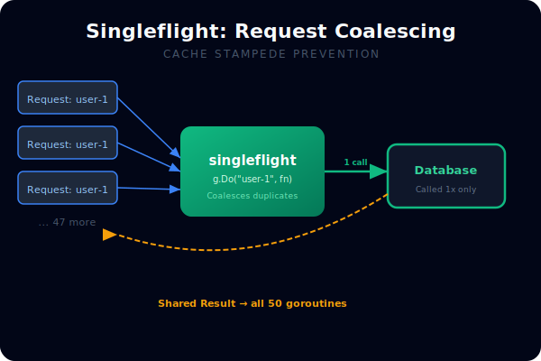
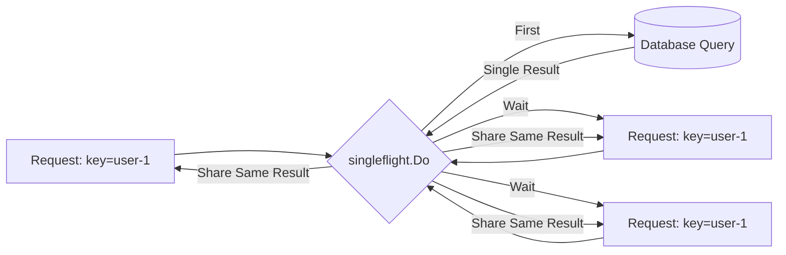

# [BK-03-CH-03] Singleflight

**Eliminating Cache Stampedes**
*Target: Memahami cara menggabungkan (coalesce) permintaan duplikat untuk mencegah overload dalam waktu < 4 menit.*

## 1. Definisi & Konsep (The Logic)

**`singleflight`** (dari paket `golang.org/x/sync/singleflight`) adalah mekanisme untuk memastikan bahwa hanya **satu** goroutine yang melakukan operasi mahal (seperti query ke database atau fetch ke API) pada satu waktu untuk kunci (key) yang sama. Semua goroutine lain yang meminta kunci yang sama akan **menunggu** dan kemudian **menerima hasil yang sama** dari goroutine pertama.

### Terminologi Utama (Senior Terms)
- **Cache Stampede** (Thundering Herd): Kondisi ketika banyak goroutine secara bersamaan melihat cache kosong dan semuanya berlomba-lomba untuk melakukan query ke database, menyebabkan overload.
- **Request Coalescing**: Proses menggabungkan banyak permintaan identik menjadi satu eksekusi.
- **Shared Result**: Hasil dari satu eksekusi yang diberikan ke semua goroutine yang menunggu.

## 2. Rasionalitas (Why & How?)

Skenario masalah: Cache Redis di-invalidate saat deployment. Tiba-tiba 500 request masuk untuk item yang sama secara bersamaan.
- **Tanpa `singleflight`**: Semua 500 goroutine melakukan query ke DB secara bersamaan → DB crash.
- **Dengan `singleflight`**: Satu goroutine melakukan query. 499 goroutine lainnya menunggu dan menerima hasil yang sama.

### Mekanisme Kerja Under-the-Hood
1. Anda memanggil `g.Do(key, fn)`.
2. Jika tidak ada goroutine yang sudah mengerjakan `key` tersebut, `fn` dieksekusi.
3. Jika sudah ada goroutine yang mengerjakan `key` yang sama, goroutine Anda ditambahkan ke antrian tunggu.
4. Saat `fn` selesai, hasilnya (termasuk error) di-broadcast ke semua goroutine yang menunggu.

## 3. Implementasi Utama (The Lab)

Lihat solusi Cache Stampede di [examples/](./examples/).
1. `01-cache-stampede`: Simulasi 50 goroutine yang meminta data yang sama; singleflight memastikan DB hanya dipanggil sekali.

## 4. Model Mental Visual (The Assets)

### Singleflight Coalescing

---
*Back to [BK-03 Page](../README.md)*
