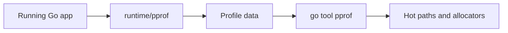

# CH-01: `pprof` CPU and Heap Analysis

## 1. Tahap 1: Source Alignment dan Judul

- **Source Link**: [Profiling Go Programs](https://go.dev/blog/profiling-go-programs) | [runtime/pprof package](https://pkg.go.dev/runtime/pprof)
- **Framing**: `pprof` penting saat performa terasa buruk tetapi sumber masalahnya belum jelas. Ia membantu menunjukkan fungsi mana yang benar-benar menghabiskan CPU atau memori.

## 2. Tahap 2: Konsep dan Rasionalitas

### Definisi
`pprof` adalah alat profiling standar Go untuk mengumpulkan dan menganalisis data CPU, heap, dan jenis profil runtime lain dari program yang berjalan.

### Rasionalitas
Pola ini dipilih karena:

1. **Optimasi jadi berbasis bukti**  
   Engineer bisa melihat fungsi mana yang benar-benar mahal, bukan menebak-nebak dari intuisi.
2. **Hubungan antar fungsi lebih terlihat**  
   Data profil menunjukkan jalur eksekusi dan akumulasi biaya di call stack.
3. **Perubahan performa lebih mudah dievaluasi**  
   Hasil profil bisa dibandingkan sebelum dan sesudah perbaikan.

### Analogi Model Mental
Bayangkan hasil CT-scan untuk aplikasi. Daripada menebak bagian tubuh mana yang bermasalah, kita bisa melihat area mana yang benar-benar aktif berlebihan atau menyimpan beban paling besar.

### Terminologi Teknis
- **Flat Time**: biaya yang langsung dihabiskan di fungsi itu sendiri.
- **Cumulative Time**: total biaya fungsi beserta fungsi-fungsi di bawahnya.
- **Sampling**: pengambilan snapshot berkala selama program berjalan.

## 3. Tahap 3: Visualisasi Sistem

## 4. Tahap 4: Mekanisme Pembuktian

Untuk CPU profiling, runtime mengambil sampel stack secara berkala. Untuk heap profiling, runtime mencatat informasi alokasi yang relevan sehingga kita bisa melihat fungsi mana yang menyebabkan tekanan memori. Hasil mentah ini kemudian dianalisis dengan `go tool pprof`.

Nilai observability-nya di `RAK-03`:
- performa dilihat sebagai perilaku terukur;
- bottleneck bisa ditelusuri sampai ke call path yang relevan;
- engineer mendapat dasar yang lebih kuat untuk memilih optimasi berikutnya.

## 5. Tahap 5: Lab Praktis

Lihat pembuktian profiling di folder [examples/](./examples):
- [01-bottleneck-demo](./examples/01-bottleneck-demo) - Program sederhana untuk menghasilkan profil CPU atau heap dan dianalisis dengan `pprof`.

---
*Status: [x] Complete*
