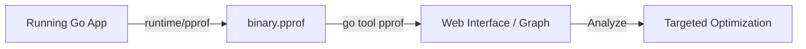

# [BK-01-CH-01] pprof CPU & Heap Analysis

**Precision Bottleneck Identification**
*Target: Mengidentifikasi fungsi yang memakan CPU atau RAM terbanyak dalam waktu < 4 menit.*

## 1. Definisi & Konsep (The Logic)

**`pprof`** adalah alat standar Go untuk mengumpulkan dan memvisualisasikan data profil dari program yang sedang berjalan. Profil CPU menunjukkan fungsi mana yang paling banyak menggunakan waktu prosesor, sementara profil Heap menunjukkan fungsi mana yang mengalokasikan memori paling banyak atau memegang memori paling lama.

### Terminologi Utama (Senior Terms)
- **Flat Time**: Waktu yang dihabiskan langsung di dalam fungsi tersebut (tidak termasuk fungsi yang dipanggil).
- **Cum (Cumulative) Time**: Total waktu yang dihabiskan di fungsi tersebut DAN semua fungsi di bawahnya dalam call stack.
- **Flamegraph**: Visualisasi hierarki yang memudahkan identifikasi "jalur panas" (hot paths) dalam eksekusi kode.
- **Sampling Rate**: Seberapa sering pprof mengambil snapshot state eksekusi (default: 100Hz untuk CPU).

## 2. Rasionalitas (Why & How?)

Mengapa menggunakan `pprof` daripada menebak-nebak?
- **Scientific Optimization**: Menghilangkan optimasi prematur dengan memfokuskan tenaga pada 5% kode yang menyebabkan 80% perlambatan.
- **Visual Clarity**: Melihat hubungan antar fungsi dalam graph yang intuitif daripada membaca baris kode yang ribuan.
- **Production-Ready**: Dapat diaktifkan melalui HTTP endpoint (`net/http/pprof`) tanpa overhead besar jika tidak sedang dalam proses sampling.

### Mekanisme Kerja Under-the-Hood
1. **CPU Profiling**: Runtime menyetel timer yang memicu signal `SIGPROF` secara berkala. Stack trace dicatat pada setiap interupsi.
2. **Heap Profiling**: Alokasi dicatat dengan menginterupsi allocator (`runtime.mallocgc`). Ukuran sampling default adalah 512KB.

## 3. Implementasi Utama (The Lab)

Lihat teknik inspeksi mendalam di [examples/](./examples/).
1. `01-bottleneck-demo`: Program yang sengaja lambat dan boros memori. Gunakan `go tool pprof` untuk menemukan penyebabnya.

## 4. Model Mental Visual (The Assets)

### pprof Data Pipeline

---
*Back to [SR-04 Page](../../README.md)*
