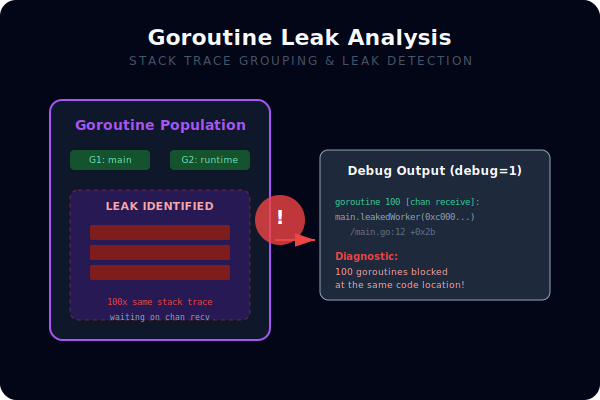

# [BK-01-CH-02] Goroutine & Thread Profiling

**Concurrency Leak Detection**
*Target: Menemukan goroutine yang "nyangkut" dan mencegah kebocoran memori dalam waktu < 4 menit.*

## 1. Definisi & Konsep (The Logic)

**Goroutine Profile** memberikan snapshot dari seluruh goroutine yang sedang berjalan beserta stack trace-nya. Ini sangat vital untuk menemukan **Goroutine Leaks**—kondisi di mana goroutine dibuat tetapi tidak pernah selesai karena menantikan channel yang tidak pernah dikirim atau mutex yang tidak pernah dilepas.

### Terminologi Utama (Senior Terms)
- **Goroutine Leak**: Kegagalan membersihkan goroutine yang sudah tidak dibutuhkan, menyebabkan konsumsi RAM (min 2KB per goroutine) naik terus-menerus.
- **Thread Profile**: Menunjukkan stack trace yang menyebabkan penciptaan OS thread baru (M dalam G-M-P model).
- **Stack Collapse**: Mengelompokkan goroutine dengan stack trace yang identik untuk memudahkan analisis ribuan goroutine sekaligus.

## 2. Rasionalitas (Why & How?)

Mengapa profiling goroutine itu kritikal?
- **Stability**: Kebocoran goroutine adalah penyebab umum aplikasi crash setelah berjalan beberapa hari (Slow Death).
- **Resource Management**: Mengetahui apakah aplikasi Anda terlalu banyak membuat OS Thread (M) yang bisa menyebabkan overhead context switch yang tinggi.
- **Deadlock Debugging**: Melihat goroutine mana yang sedang "blocking" pada resource tertentu secara visual.

### Mekanisme Kerja Under-the-Hood
1. Saat profil diminta, runtime melakukan "Stop The World" (STW) singkat.
2. Runtime menyisir seluruh stack goroutine dan mencatat statusnya (Runnalbe, Waiting, Syscall, dll).
3. Data dikemas dalam format pprof untuk dianalisis.

## 3. Implementasi Utama (The Lab)

Lihat teknik deteksi kebocoran di [examples/](./examples/).
1. `01-leak-detection`: Simulasi sebuah fungsi yang meninggalkan goroutine "liar" setiap kali dipanggil, dan cara menemukannya menggunakan profiling.

## 4. Model Mental Visual (The Assets)



### Goroutine Stack Inspection
```mermaid
graph TD
    Trigger[Goroutine Profile Request] -- STW --> Runtime[Go Runtime]
    Runtime --> G1[G1: main.worker - Waiting]
    Runtime --> G2[G2: main.worker - Waiting]
    Runtime --> G3[G3: runtime.gc - Running]
    
    G1 & G2 --> Group[Grouped by Stack Trace]
    Group -- Visualized --> Developer[Identified Leak in worker()]
```

---
*Back to [SR-04 Page](../../README.md)*
