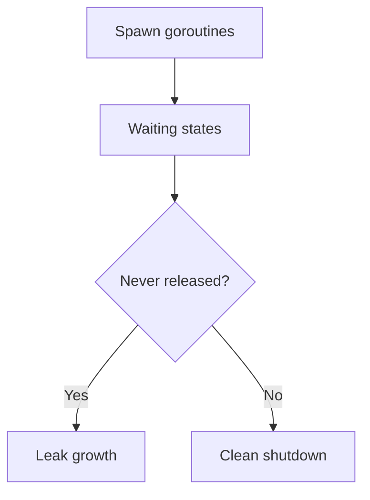

# CH-02: Goroutine and Thread Profiling

## 1. Tahap 1: Source Alignment dan Judul

- **Source Link**: [runtime/pprof package](https://pkg.go.dev/runtime/pprof) | [Debugging Go routine leaks](https://go.dev/blog/pipelines)
- **Framing**: Tidak semua masalah performa berasal dari CPU. Kadang aplikasi melambat atau membengkak karena goroutine yang tidak pernah selesai atau thread yang bertambah tanpa kontrol.

## 2. Tahap 2: Konsep dan Rasionalitas

### Definisi
Goroutine dan thread profiling adalah teknik untuk melihat snapshot goroutine aktif, stack trace-nya, dan pola penggunaan thread sistem agar leak atau blocking bisa teridentifikasi.

### Rasionalitas
Pola ini dipilih karena:

1. **Leak lebih cepat terlihat**  
   Goroutine yang terus hidup tanpa alasan bisa dideteksi dari jumlah dan stack trace yang berulang.
2. **Blocking pattern lebih mudah dibaca**  
   Profil membantu menunjukkan goroutine mana yang menunggu terlalu lama.
3. **Skala concurrency bisa dipantau**  
   Engineer bisa melihat kapan beban goroutine atau thread mulai tidak sehat.

### Analogi Model Mental
Bayangkan pusat kontrol lalu lintas. Yang dihitung bukan cuma kendaraan yang bergerak, tetapi juga kendaraan yang macet, berhenti terlalu lama, atau tersesat di rute yang tidak pernah selesai.

### Terminologi Teknis
- **Goroutine Leak**: goroutine yang tetap hidup meski tugasnya seharusnya sudah selesai.
- **Stack Grouping**: pengelompokan goroutine berdasarkan stack trace yang sama.
- **Thread Profile**: snapshot yang membantu melihat penggunaan OS thread.

## 3. Tahap 3: Visualisasi Sistem

## 4. Tahap 4: Mekanisme Pembuktian

Saat profil goroutine diambil, runtime mencatat stack dari goroutine aktif beserta statusnya. Dari sana, engineer bisa melihat pola yang berulang, jalur blocking, atau goroutine yang terus bertambah tanpa pernah hilang. Thread profiling memberi lapisan tambahan untuk memahami apakah concurrency mulai mendorong biaya OS thread terlalu tinggi.

Nilai observability-nya untuk `RAK-03`:
- concurrency tidak hanya dilihat dari logika kode, tetapi juga dari perilaku hidup-mati goroutine;
- leak bisa dibaca sebagai gejala operasional, bukan hanya bug teoritis;
- troubleshooting menjadi lebih cepat saat stack trace dikelompokkan dengan baik.

## 5. Tahap 5: Lab Praktis

Lihat pembuktian di folder [examples/](./examples):
- [01-leak-detection](./examples/01-leak-detection) - Simulasi kebocoran goroutine dan cara mengamatinya lewat profiling.

---
*Status: [x] Complete*
