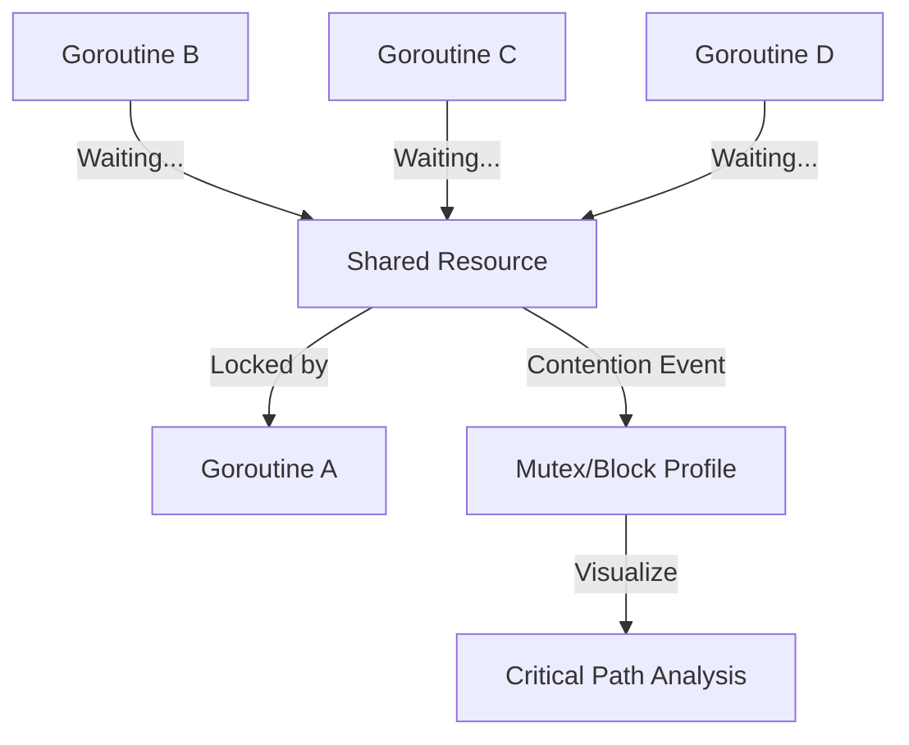

# [BK-01-CH-03] Block & Mutex Contention

**Breaking Synchronization Bottlenecks**
*Target: Menemukan titik di mana goroutine Anda membuang waktu karena antre kunci dalam waktu < 4 menit.*

## 1. Definisi & Konsep (The Logic)

**Blocking Profile** mencatat di mana goroutine menunggu pada primitif sinkronisasi (seperti channel, select, mutex). **Mutex Profile** secara khusus mencatat waktu yang dihabiskan goroutine menunggu untuk mendapatkan Mutex yang sedang dikunci oleh orang lain (Contention).

### Terminologi Utama (Senior Terms)
- **Lock Contention**: Kondisi di mana banyak goroutine mencoba mengakses resource yang sama (yang dilindungi Mutex) secara bersamaan, menyebabkan degradasi performa yang signifikan.
- **`runtime.SetBlockProfileRate`**: Fungsi untuk menentukan seberapa sering blocking event dicatat (default: 0 / tidak dicatat).
- **`runtime.SetMutexProfileFraction`**: Fungsi untuk menentukan fraksi kejadian contention mutex yang akan dicatat.

## 2. Rasionalitas (Why & How?)

Mengapa profiling contention itu penting?
- **Scaling Limit**: Aplikasi Anda mungkin terlihat cepat di laptop, tetapi saat load tinggi di server, "Lock Contention" bisa membuat performa merosot karena goroutine saling menunggu.
- **Architecture Validation**: Jika Mutex Profiling menunjukkan angka tinggi, mungkin Anda harus menggunakan teknik lain (seperti Sharding Mutex atau Channels) untuk mendistribusikan beban.
- **Deadlock Prevention**: Membantu mengidentifikasi pola penguncian yang tidak efisien sebelum menjadi deadlock permanen.

### Mekanisme Kerja Under-the-Hood
1. Saat goroutine mencoba `Lock()` dan gagal, ia masuk ke antrean tunggu.
2. Runtime mencatat durasi tunggu ini jika profiling aktif.
3. Event ini dikumpulkan dalam profile yang bisa dianalisis dengan `go tool pprof`.

## 3. Implementasi Utama (The Lab)

Lihat visualisasi hambatan sinkronisasi di [examples/](./examples/).
1. `01-mutex-bottleneck`: Simulasi 1000 goroutine yang memperebutkan satu Mutex global, dan cara menggunakan mutex profiling untuk memvalidasi masalah ini.

## 4. Model Mental Visual (The Assets)

### Mutex Contention Graph

---
*Back to [SR-04 Page](../../README.md)*
