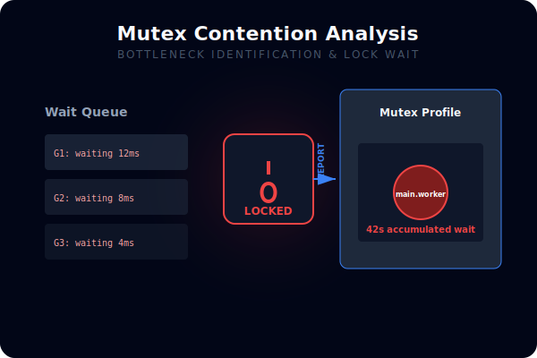
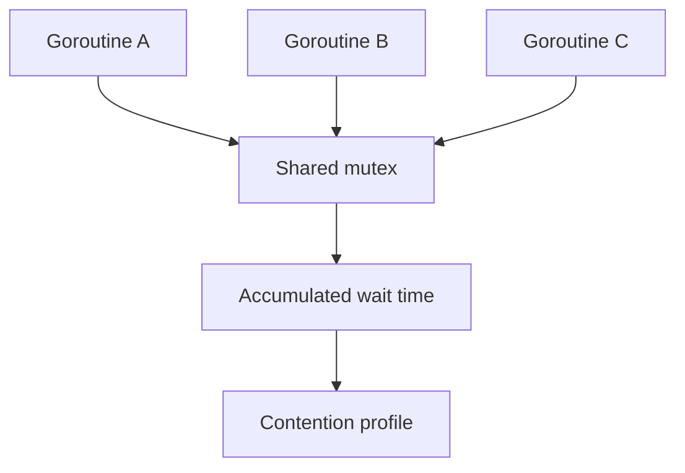

# CH-03: Block and Mutex Contention

## 1. Tahap 1: Source Alignment dan Judul

- **Source Link**: [runtime package](https://pkg.go.dev/runtime) | [Data Race Detector](https://go.dev/doc/articles/race_detector)
- **Framing**: Aplikasi bisa terlihat "CPU-nya santai" tapi tetap lambat karena goroutine terlalu banyak menunggu lock atau primitif sinkronisasi lain. Di sinilah profiling contention jadi penting.

## 2. Tahap 2: Konsep dan Rasionalitas

### Definisi
Contention profiling adalah teknik untuk melihat biaya waktu yang terbuang saat goroutine menunggu lock, channel, atau resource sinkronisasi lain.

### Rasionalitas
Pola ini dipilih karena:

1. **Bottleneck sinkronisasi jadi terlihat**  
   Masalah performa tidak selalu berasal dari komputasi berat; sering kali masalahnya adalah antrean menunggu.
2. **Skalabilitas bisa dievaluasi lebih jujur**  
   Lock contention biasanya baru terlihat jelas saat load mulai naik.
3. **Keputusan desain lebih terarah**  
   Data contention membantu menentukan apakah perlu sharding, mengubah granularity lock, atau mengganti pola koordinasi.

### Analogi Model Mental
Bayangkan loket layanan dengan pintu masuk tunggal. Masalahnya bukan jumlah pegawai di gedung, tetapi panjang antrean di satu pintu yang dipakai semua orang secara bersamaan.

### Terminologi Teknis
- **Block Profile**: profil waktu tunggu pada operasi blocking.
- **Mutex Profile**: profil waktu tunggu untuk memperoleh mutex.
- **Contention**: kondisi ketika banyak goroutine berebut resource sinkronisasi yang sama.

## 3. Tahap 3: Visualisasi Sistem

## 4. Tahap 4: Mekanisme Pembuktian

Saat block atau mutex profiling diaktifkan, runtime mulai mencatat event tunggu yang relevan. Dari hasil itu, engineer bisa melihat bagian kode mana yang paling sering menyebabkan antrean sinkronisasi dan seberapa mahal biaya tunggunya.

Nilai observability-nya di `RAK-03`:
- sinkronisasi diperlakukan sebagai sumber biaya yang bisa diukur;
- bottleneck load tinggi bisa dideteksi lebih dini;
- optimasi arsitektur concurrency bisa diarahkan berdasarkan data contention nyata.

## 5. Tahap 5: Lab Praktis

Lihat pembuktian di folder [examples/](./examples):
- [01-mutex-bottleneck](./examples/01-mutex-bottleneck) - Simulasi lock contention untuk melihat dampak antrean mutex pada performa.

---
*Status: [x] Complete*
