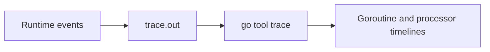

# CH-01: Execution Tracer

## 1. Tahap 1: Source Alignment dan Judul

- **Source Link**: [Go execution tracer](https://pkg.go.dev/cmd/trace) | [runtime/trace package](https://pkg.go.dev/runtime/trace)
- **Framing**: Execution trace dipakai saat kita perlu melihat urutan event runtime secara detail, bukan hanya agregat biaya seperti di profil sampling.

## 2. Tahap 2: Konsep dan Rasionalitas

### Definisi
Execution tracer adalah mekanisme pencatatan event runtime yang menunjukkan aktivitas goroutine, processor, blocking, syscall, dan event penting lain dalam bentuk timeline.

### Rasionalitas
Pola ini dipilih karena:

1. **Interaksi konkuren lebih mudah dilihat**  
   Kita bisa membaca kapan goroutine berjalan, terblokir, atau dibangunkan kembali.
2. **Lonjakan latensi lebih mudah dihubungkan ke event runtime**  
   Tracing membantu menunjukkan apakah masalah datang dari blocking, GC, atau orchestration goroutine.
3. **Urutan kerja program jadi lebih nyata**  
   Timeline memberi konteks yang tidak selalu terlihat di CPU profile biasa.

### Analogi Model Mental
Bayangkan rekaman CCTV jalur produksi. Profiling memberi statistik biaya rata-rata, sedangkan trace menunjukkan urutan siapa bergerak kapan, siapa menunggu, dan di titik mana antrean mulai terbentuk.

### Terminologi Teknis
- **Event Timeline**: urutan event runtime berdasarkan waktu.
- **STW (Stop The World)**: momen runtime menghentikan aktivitas normal untuk pekerjaan internal tertentu.
- **Handoff**: perpindahan kerja atau pembangkitan goroutine lain yang terlihat dalam trace.

## 3. Tahap 3: Visualisasi Sistem

## 4. Tahap 4: Mekanisme Pembuktian

Berbeda dari profiling sampling, tracing mencatat event penting runtime secara eksplisit selama periode tertentu. Hasilnya adalah file trace yang bisa dibaca lewat `go tool trace` untuk melihat hubungan waktu antar goroutine, blocking, dan aktivitas processor.

Nilai observability-nya untuk `RAK-03`:
- masalah konkuren bisa dilihat sebagai urutan kejadian;
- bottleneck yang muncul dari koordinasi runtime lebih mudah dibaca;
- engineer bisa menjembatani logika aplikasi dengan perilaku eksekusi yang sebenarnya.

## 5. Tahap 5: Lab Praktis

Lihat pembuktian tracing di folder [examples/](./examples):
- [01-trace-demo](./examples/01-trace-demo) - Program konkuren yang menghasilkan file trace untuk dianalisis dengan `go tool trace`.

---
*Status: [x] Complete*
