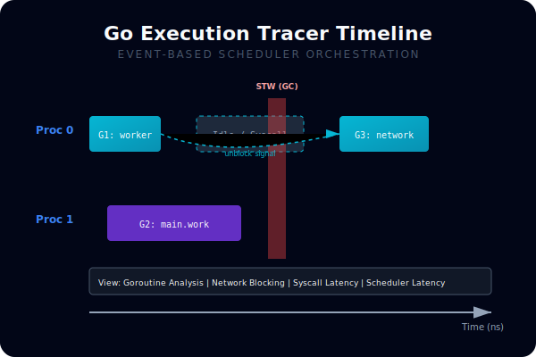
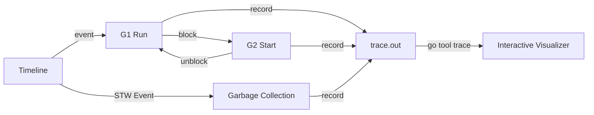

# [BK-02-CH-01] Execution Tracer

**Visualizing Goroutine Orchestration**
*Target: Melihat bagaimana Scheduler Go bekerja dan berpindah antar-goroutine dalam waktu < 4 menit.*

## 1. Definisi & Konsep (The Logic)

**`runtime/trace`** adalah alat visualisasi tingkat rendah yang mencatat "event" internal selama eksekusi program. Berbeda dengan `pprof` yang melakukan sampling secara berkala, `trace` mencatat setiap perubahan status goroutine (misal: creation, blocking, unblocking, syscall) secara detail di sepanjang garis waktu (timeline).

### Terminologi Utama (Senior Terms)
- **STW (Stop The World)**: Waktu yang dihabiskan runtime untuk menghentikan seluruh aplikasi demi keperluan internal (seperti GC).
- **Processor Timeline**: Visualisasi penggunaan core CPU (P dalam model G-M-P) oleh goroutine.
- **Handoff**: Momen ketika satu goroutine membangunkan goroutine lain, divisualisasikan dengan panah penghubung dalam trace UI.

## 2. Rasionalitas (Why & How?)

Kapan harus menggunakan `trace` alih-alih `pprof`?
- **Concurrent Interaction**: Anda ingin melihat mengapa sebuah goroutine tidak berjalan meskipun ada CPU kosong (ternyata ia menunggu kunci dari goroutine lain).
- **Latency Spikes**: Menemukan lonjakan latensi yang disebabkan oleh Garbage Collection atau Scheduler latency.
- **Task Dependencies**: Melihat aliran data antar goroutine yang kompleks (seperti pipeline).

### Mekanisme Kerja Under-the-Hood
1. Binary `trace` mengaktifkan pencatatan event global di runtime.
2. Setiap event (misalnya `GoStart`, `GoBlock`, `ProcStop`) dicatat dengan timestamp nanodetik ke buffer internal.
3. Buffer tersebut di-*flush* ke file `.trace` yang nantinya diproses oleh `go tool trace`.

## 3. Implementasi Utama (The Lab)

Lihat visualisasi aliran eksekusi di [examples/](./examples/).
1. `01-trace-demo`: Program konkuren kompleks yang menghasilkan file `.trace`. Gunakan `go tool trace` untuk menganalisis urutan eksekusinya.

## 4. Model Mental Visual (The Assets)

### Execution Trace Timeline

---
*Back to [SR-04 Page](../../README.md)*
