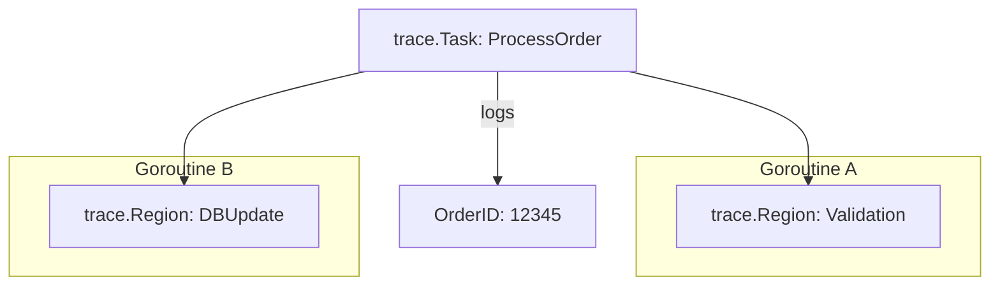

# [BK-02-CH-02] User-defined Tasks & Regions

**Adding Semantic Meaning to Traces**
*Target: Mengelompokkan event trace ke dalam unit logis (seperti "Request" atau "DatabaseQuery") dalam waktu < 4 menit.*

## 1. Definisi & Konsep (The Logic)

Meskipun `runtime/trace` memberikan detail luar biasa tentang goroutine, seringkali sulit untuk menghubungkan goroutine-goroutine tersebut dengan unit kerja tingkat aplikasi (seperti satu HTTP Request). **User-defined Tasks** dan **Regions** memungkinkan Anda memberi label pada blok kode sehingga muncul sebagai "Spans" yang bermakna dalam visualisasi trace.

### Terminologi Utama (Senior Terms)
- **Task**: Satu unit kerja logis yang bisa mencakup banyak goroutine (mirip dengan 'Span' di OpenTelemetry).
- **Region**: Sub-bagian dari tugas yang terjadi dalam satu goroutine tunggal. Digunakan untuk menandai fase spesifik (misal: "JSON.Unmarshal").
- **Log**: Menempelkan pesan teks singkat ke dalam tugas tertentu untuk keperluan debugging detail.

## 2. Rasionalitas (Why & How?)

Mengapa menggunakan Task & Region?
- **Context Awareness**: Memudahkan identifikasi goroutine mana yang bekerja untuk request ID yang mana.
- **Latency Attribution**: Mengetahui fase mana dari sebuah tugas (misal: "Validation" vs "DB Save") yang memakan waktu paling lama.
- **Correlation**: Menghubungkan log aplikasi langsung ke garis waktu eksekusi scheduler.

### Mekanisme Kerja Under-the-Hood
1. `trace.NewTask` menciptakan context baru yang membawa task ID.
2. Setiap goroutine yang dibuat dengan context tersebut secara otomatis akan diasosiasikan dengan task yang sama.
3. Region dicatat sebagai entry/exit points dalam file trace, memungkinkan tool visualisasi menggambar baris horizontal (gantt chart) untuk region tersebut.

## 3. Implementasi Utama (The Lab)

Lihat penambahan semantik trace di [examples/](./examples/).
1. `01-semantic-trace`: Simulasi pemrosesan pesanan (Order Processing) dengan label Task dan Region yang jelas.

## 4. Model Mental Visual (The Assets)

### Task & Region Hierarchy

---
*Back to [SR-04 Page](../../README.md)*
