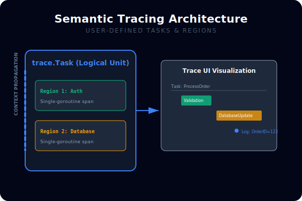
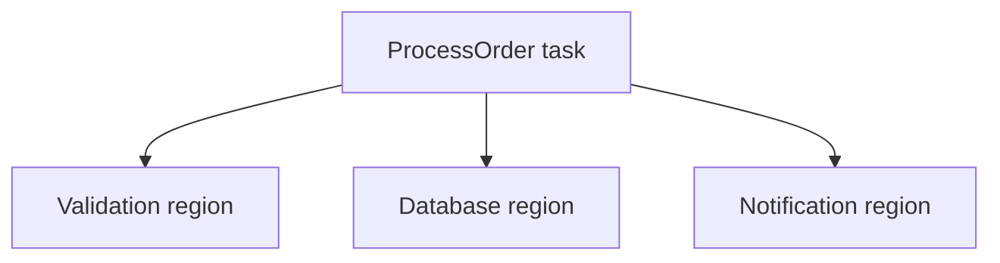

# CH-02: User-defined Tasks and Regions

## 1. Tahap 1: Source Alignment dan Judul

- **Source Link**: [runtime/trace package](https://pkg.go.dev/runtime/trace) | [Go execution tracer](https://pkg.go.dev/cmd/trace)
- **Framing**: Trace runtime mentah sangat detail, tetapi tanpa semantik tambahan sering sulit dikaitkan dengan unit kerja aplikasi. Task dan region membantu menjembatani dua dunia itu.

## 2. Tahap 2: Konsep dan Rasionalitas

### Definisi
User-defined tasks dan regions adalah label semantik yang bisa ditambahkan ke trace agar event runtime dapat dikelompokkan ke dalam unit kerja logis, seperti request, job, atau fase pemrosesan tertentu.

### Rasionalitas
Pola ini dipilih karena:

1. **Trace jadi lebih mudah dibaca**  
   Engineer bisa melihat event runtime dalam konteks tugas bisnis yang nyata.
2. **Atribusi latensi lebih jelas**  
   Fase kerja seperti validasi, parsing, atau database update bisa dibedakan di dalam satu task.
3. **Korelasi antar goroutine meningkat**  
   Beberapa goroutine yang bekerja untuk tujuan sama bisa dipahami sebagai satu unit logis.

### Analogi Model Mental
Bayangkan gedung kantor yang punya CCTV di semua koridor. Tanpa label, kita hanya melihat orang bergerak. Dengan badge tamu dan label ruangan, kita tahu siapa datang untuk urusan apa dan di bagian mana waktu paling banyak terbuang.

### Terminologi Teknis
- **Task**: satu unit kerja logis yang dapat melibatkan banyak goroutine.
- **Region**: fase spesifik di dalam satu task atau satu goroutine.
- **Trace Log**: catatan teks kecil yang ditautkan ke task untuk memberi konteks tambahan.

## 3. Tahap 3: Visualisasi Sistem

## 4. Tahap 4: Mekanisme Pembuktian

Dengan `trace.NewTask` dan region terkait, context trace membawa identitas task ke sepanjang eksekusi yang relevan. Visualizer kemudian dapat menampilkan event runtime bukan hanya sebagai deretan goroutine, tetapi sebagai unit kerja yang lebih dekat ke domain aplikasi.

Nilai observability-nya di `RAK-03`:
- trace menjadi lebih ramah bagi engineer aplikasi, bukan hanya bagi orang yang fokus pada runtime;
- bottleneck bisa diatribusikan ke fase bisnis yang nyata;
- observability menjadi jembatan antara event low-level dan makna high-level.

## 5. Tahap 5: Lab Praktis

Lihat pembuktian semantic trace di folder [examples/](./examples):
- [01-semantic-trace](./examples/01-semantic-trace) - Contoh task dan region untuk memberi label semantik pada alur eksekusi.

---
*Status: [x] Complete*
