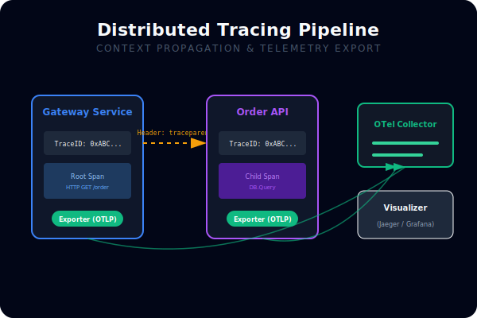
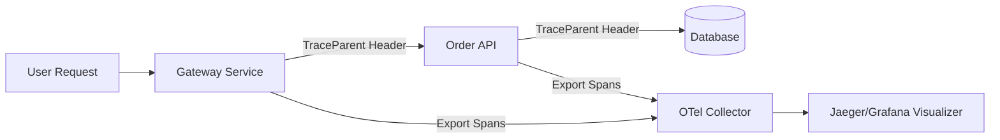

# [BK-02-CH-03] Distributed Tracing Concepts (OpenTelemetry)

**Connecting Microservices via Context**
*Target: Memahami bagaimana trace mengalir antar-layanan melalui network headers dalam waktu < 4 menit.*

## 1. Definisi & Konsep (The Logic)

**Distributed Tracing** adalah perluasan dari tracing lokal yang melacak perjalanan sebuah request melewati batas-batas proses dan mesin (microservices). Standar industri saat ini adalah **OpenTelemetry (OTel)**, yang menyediakan API dan SDK untuk mengumpulkan trace, metrik, dan log secara terpadu.

### Terminologi Utama (Senior Terms)
- **Span**: Unit kerja dasar dalam distributed trace (setara dengan 'Region' di internal Go trace, tapi cross-process).
- **Trace ID**: Pengenal unik global untuk satu seluruh perjalanan request dari awal sampai akhir.
- **Context Propagation**: Proses pengiriman Trace ID dan Span ID melalui header protokol (sepert HTTP `traceparent`) antar layanan.
- **Collector**: Komponen antara yang menerima data trace dari aplikasi sebelum dikirim ke backend (seperti Jaeger atau Honeycomb).

## 2. Rasionalitas (Why & How?)

Mengapa beralih dari internal tracing ke Distributed Tracing?
- **Microservice Clarity**: Mengetahui layanan mana yang menyebabkan perlambatan dalam rantai panggilan API yang panjang.
- **Error Root Cause**: Melacak error yang terjadi di layanan downstream kembali ke pemicu aslinya di gateway.
- **Standardization**: Menggunakan satu standar (OTel) yang didukung oleh berbagai bahasa pemograman dan vendor cloud.

### Mekanisme Kerja Under-the-Hood
1. Aplikasi membuat "Root Span" saat request masuk.
2. Saat melakukan panggilan ke layanan lain (misal via HTTP), SDK OTel menyisipkan Context ke dalam Header.
3. Layanan penerima mengekstrak Context tersebut dan membuat "Child Span".
4. Seluruh Span dikirim ke Collector dan disatukan berdasarkan Trace ID yang sama.

## 3. Implementasi Utama (The Lab)

Lihat simulasi propagasi konteks di [examples/](./examples/).
1. `01-otel-simulation`: Simulasi konseptual bagaimana Header HTTP digunakan untuk meneruskan ID trace antar dua fungsi yang bertindak sebagai "layanan" berbeda.

## 4. Model Mental Visual (The Assets)

### Distributed Tracing Pipeline

---
*Back to [SR-04 Page](../../README.md)*
