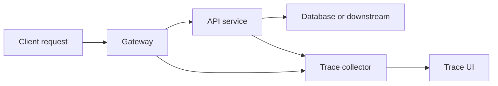

# CH-03: Distributed Tracing Concepts with OpenTelemetry

## 1. Tahap 1: Source Alignment dan Judul

- **Source Link**: [OpenTelemetry for Go](https://opentelemetry.io/docs/languages/go/) | [context package](https://pkg.go.dev/context)
- **Framing**: Saat request melintasi lebih dari satu proses atau service, trace lokal tidak lagi cukup. Di sinilah distributed tracing dan context propagation menjadi penting.

## 2. Tahap 2: Konsep dan Rasionalitas

### Definisi
Distributed tracing adalah teknik observability untuk melacak perjalanan satu request melewati beberapa service atau komponen, biasanya melalui span dan trace ID yang dibawa lintas proses.

### Rasionalitas
Pola ini dipilih karena:

1. **Akar latensi lintas layanan lebih mudah ditemukan**  
   Engineer bisa melihat service mana yang paling banyak menambah waktu.
2. **Korelasi request meningkat**  
   Satu request bisa dilacak dari pintu masuk sampai komponen downstream.
3. **Standarisasi observability lebih baik**  
   OpenTelemetry memberi model umum yang didukung banyak bahasa dan backend.

### Analogi Model Mental
Bayangkan paket ekspedisi internasional. Satu nomor resi yang sama dipakai saat paket berpindah dari gudang lokal, bandara, bea cukai, hingga kurir akhir. Tanpa nomor resi bersama, alur paket akan terpecah-pecah dan sulit ditelusuri.

### Terminologi Teknis
- **Span**: unit kerja dalam trace terdistribusi.
- **Trace ID**: identitas global untuk satu perjalanan request.
- **Context Propagation**: penerusan identitas trace melalui header atau metadata antar service.

## 3. Tahap 3: Visualisasi Sistem

## 4. Tahap 4: Mekanisme Pembuktian

Saat request masuk, sistem membuat root span. Ketika request diteruskan ke service lain, identitas trace dibawa lewat context atau header. Service downstream membuat span baru yang terhubung ke trace yang sama. Hasil akhirnya kemudian dikirim ke collector atau backend observability untuk divisualisasikan.

Nilai observability-nya untuk `RAK-03`:
- request lintas service bisa dilihat sebagai satu alur utuh;
- bottleneck distribusi lebih mudah dilacak;
- engineer memiliki bahasa observability yang konsisten dari level lokal sampai terdistribusi.

## 5. Tahap 5: Lab Praktis

Lihat pembuktian konsep di folder [examples/](./examples):
- [01-otel-simulation](./examples/01-otel-simulation) - Simulasi sederhana propagasi trace context antar komponen.

---
*Status: [x] Complete*
