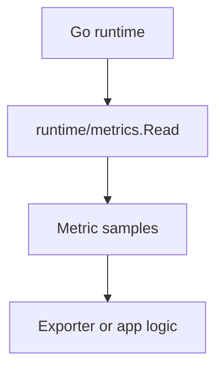

# CH-01: `runtime/metrics`

## 1. Tahap 1: Source Alignment dan Judul

- **Source Link**: [runtime/metrics package](https://pkg.go.dev/runtime/metrics) | [Go 1.16 Release Notes](https://go.dev/doc/go1.16)
- **Framing**: `runtime/metrics` penting karena ia memberi cara yang lebih seragam dan efisien untuk membaca data internal runtime dibanding pendekatan lama yang lebih sempit atau lebih berat.

## 2. Tahap 2: Konsep dan Rasionalitas

### Definisi
`runtime/metrics` adalah API standar Go untuk membaca kumpulan metrik runtime melalui nama metrik dan sample value yang terstruktur.

### Rasionalitas
Pola ini dipilih karena:

1. **Overhead pembacaan lebih terkendali**  
   API ini dirancang agar lebih cocok untuk kebutuhan telemetry modern.
2. **Semantik metrik lebih konsisten**  
   Metric name dan type memberi format yang lebih jelas untuk integrasi tool observability.
3. **Integrasi dengan sistem monitoring lebih mudah**  
   Data runtime bisa dijembatani ke exporter atau collector lain tanpa perlu banyak adapter khusus.

### Analogi Model Mental
Bayangkan dashboard kendaraan modern. Dulu Anda mungkin harus membuka kap mesin untuk membaca banyak hal secara manual. Sekarang sensor-sensor penting sudah tersedia lewat panel yang lebih standar dan seragam.

### Terminologi Teknis
- **Metric Descriptor**: informasi tentang nama dan jenis metrik.
- **Sample**: nilai metrik yang diambil pada satu waktu.
- **Gauge / Counter / Histogram Semantics**: makna bentuk nilai yang berbeda.

## 3. Tahap 3: Visualisasi Sistem

## 4. Tahap 4: Mekanisme Pembuktian

Engineer menyiapkan daftar sample yang ingin diambil, lalu memanggil `metrics.Read` untuk mengisi nilainya dari runtime saat itu. Karena format metrik sudah distandarkan, data tersebut lebih mudah diteruskan ke sistem monitoring lain atau ditafsirkan langsung di aplikasi.

Nilai observability-nya untuk `RAK-03`:
- telemetry runtime menjadi lebih eksplisit dan modern;
- data internal runtime lebih mudah dihubungkan ke sistem observability aplikasi;
- pembacaan metrik tidak lagi bergantung pada API lama yang lebih kasar.

## 5. Tahap 5: Lab Praktis

Lihat pembuktian metrics modern di folder [examples/](./examples):
- [01-runtime-metrics](./examples/01-runtime-metrics) - Contoh membaca metrik runtime seperti memori dan jumlah goroutine.

---
*Status: [x] Complete*
