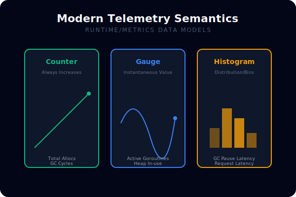
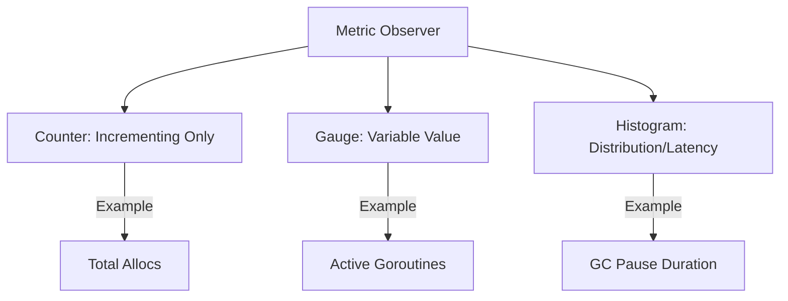

# [BK-03-CH-01] runtime/metrics

**Modern Telemetry API**
*Target: Mengambil data performa internal Go (seperti penggunaan heap atau jumlah goroutine) secara efisien dalam waktu < 4 menit.*

## 1. Definisi & Konsep (The Logic)

**`runtime/metrics`** adalah API yang diperkenalkan di Go 1.16 untuk menggantikan sistem metrik lama (seperti `runtime.ReadMemStats` dan `expvar`). API ini dirancang untuk performa tinggi, efisiensi alokasi, dan kemudahan bagi library telemetry untuk mengekstrak data internal runtime.

### Terminologi Utama (Senior Terms)
- **Metric Descriptor**: Deskripsi statis tentang apa yang diukur oleh sebuah metrik (nama, unit, tipe).
- **Metric Value**: Hasil observasi yang bisa bertipe `Uint64`, `Float64`, atau `Float64Histogram`.
- **Cumulative vs Gauge**: Memahami apakah nilai metrik bertambah terus (seperti total alokasi) atau fluktuatif (seperti jumlah goroutine saat ini).

## 2. Rasionalitas (Why & How?)

Mengapa beralih ke `runtime/metrics`?
- **Low Overhead**: Menghindari beban STW (Stop The World) yang sering terjadi pada `ReadMemStats`.
- **Granularity**: Memberikan akses ke metrik baru yang tidak tersedia sebelumnya, seperti durasi pause GC secara detail.
- **Unified Interface**: Memberikan format yang seragam bagi seluruh metrik runtime, memudahkan integrasi dengan Prometheus atau Datadog.

### Mekanisme Kerja Under-the-Hood
1. Anda mendefinisikan daftar nama metrik yang ingin diambil dalam `[]metrics.Sample`.
2. Panggil `metrics.Read()` untuk mengisi sample tersebut dengan nilai terbaru dari runtime.
3. Gunakan histogram bins untuk analisis latensi atau distribusi ukuran memori yang lebih presisi.

## 3. Implementasi Utama (The Lab)

Lihat pengambilan metrik modern di [examples/](./examples/).
1. `01-runtime-metrics`: Cara membaca penggunaan memori dan jumlah goroutine menggunakan API `runtime/metrics` yang baru.

## 4. Model Mental Visual (The Assets)

### Metric Value Semantics

---
*Back to [SR-04 Page](../../README.md)*
