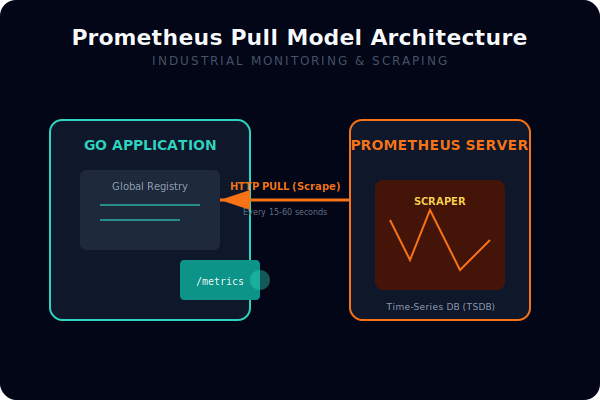

# CH-02: Prometheus Integration

## 1. Tahap 1: Source Alignment dan Judul

- **Source Link**: [Prometheus Go client](https://pkg.go.dev/github.com/prometheus/client_golang/prometheus) | [Writing exporters](https://prometheus.io/docs/instrumenting/writing_exporters/)
- **Framing**: Prometheus penting di ekosistem Go karena ia memberi pola yang jelas untuk mengekspor metrik aplikasi ke sistem monitoring yang bisa di-scrape dan divisualisasikan.

## 2. Tahap 2: Konsep dan Rasionalitas

### Definisi
Prometheus integration adalah proses mendefinisikan metrik, mendaftarkannya ke registry, lalu mengeksposnya melalui endpoint seperti `/metrics` agar bisa diambil oleh Prometheus server.

### Rasionalitas
Pola ini dipilih karena:

1. **Metrik aplikasi jadi mudah dikumpulkan**  
   Counter, gauge, dan histogram bisa diekspos dengan format yang sudah mapan.
2. **Ekosistem tooling sangat matang**  
   Dashboard, alerting, dan penyimpanan time-series banyak berputar di sekitar model Prometheus.
3. **Label memberi dimensi analisis yang kaya**  
   Request method, status code, atau tenant bisa dipakai untuk slicing data.

### Analogi Model Mental
Bayangkan pos pengukuran cuaca otomatis. Sensor di aplikasi terus mengisi data, lalu stasiun pusat datang secara berkala untuk mengambilnya dan menyusunnya menjadi peta cuaca operasional.

### Terminologi Teknis
- **Registry**: tempat seluruh metrik didaftarkan.
- **Pull Model**: model di mana Prometheus mengambil data dari aplikasi.
- **Labels**: dimensi tambahan untuk memecah dan mengelompokkan metrik.

## 3. Tahap 3: Visualisasi Sistem



```mermaid
graph LR
    App[Go app] --> Metrics[/metrics endpoint]
    Prom[Prometheus server] -->|scrape| Metrics
    Prom --> Grafana[Dashboard or alerts]
```

## 4. Tahap 4: Mekanisme Pembuktian

Aplikasi Go membuat metrik melalui library client, lalu memperbaruinya saat event penting terjadi. Endpoint metrics menyajikan nilai-nilai itu dalam format yang bisa dibaca Prometheus. Prometheus kemudian melakukan scraping berkala dan menyimpan hasilnya untuk query, dashboard, atau alert.

Nilai observability-nya untuk `RAK-03`:
- telemetry aplikasi bisa dikumpulkan secara konsisten;
- engineer mendapat jalur standar dari event aplikasi ke dashboard operasional;
- instrumentasi menjadi bagian rutin dari workflow engineering, bukan tambahan belakangan.

## 5. Tahap 5: Lab Praktis

Lihat pembuktian exporter di folder [examples/](./examples):
- [01-prom-exporter](./examples/01-prom-exporter) - HTTP server sederhana yang mengekspos metrik Prometheus.

---
*Status: [x] Complete*
