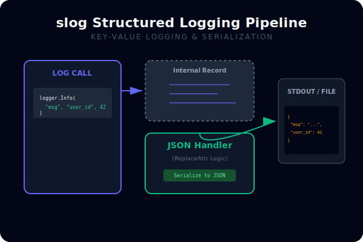
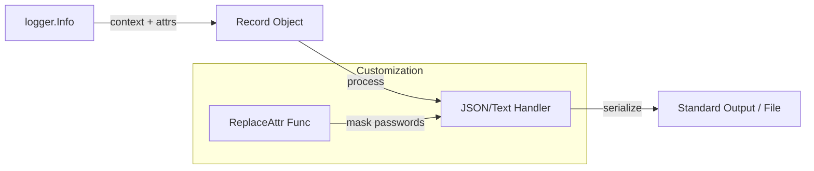

# [BK-03-CH-03] Structured Logging (slog)

**Machine-Readable Observability**
*Target: Mengubah log teks berantakan menjadi data JSON yang mudah diindeks oleh ELK/Grafana Loki dalam waktu < 4 menit.*

## 1. Definisi & Konsep (The Logic)

**`log/slog`** adalah paket logging terstruktur standar yang diperkenalkan pada Go 1.21. Berbeda dengan paket `log` tradisional yang hanya mencetak string, `slog` memperlakukan log sebagai kumpulan pasangan key-value yang bisa diformat menjadi JSON secara native tanpa bantuan library pihak ketiga (seperti Logrus atau Zap).

### Terminologi Utama (Senior Terms)
- **Logger**: Objek utama yang digunakan untuk mencatat log dengan level tertentu.
- **Handler**: Komponen yang menentukan *bagaimana* dan *ke mana* log dikirim (misal: JSON ke stdout, Text ke file).
- **Attributes (Attr)**: Pasangan key-value yang memberikan konteks tambahan pada pesan log (misal: `user_id=42`).
- **Group**: Mengelompokkan atribut terkait ke dalam sub-objek (misal: grup `request` berisi `method`, `path`, dan `status`).

## 2. Rasionalitas (Why & How?)

Mengapa `slog` adalah masa depan logging Go?
- **Performance**: Dirancang dengan alokasi memori yang sangat rendah, seringkali setara atau lebih cepat dari library pihak ketiga yang populer.
- **Interoperability**: Menjadi standar library berarti seluruh ekosistem Go akan mulai berbicara dalam "bahasa" yang sama untuk logging.
- **Searchability**: Log JSON sangat mudah di-*parse* oleh sistem log management (Loki, Elasticsearch) untuk pencarian dan pembuatan dashboard.

### Mekanisme Kerja Under-the-Hood
1. User memanggil `logger.Info("pesan", "key", "val")`.
2. Input tersebut dibentuk menjadi objek `Record`.
3. `Record` dikirim ke `Handler`.
4. `Handler` melakukan serialisasi (misal ke JSON) dan menuliskannya ke `io.Writer`.

## 3. Implementasi Utama (The Lab)

Lihat teknik logging terstruktur di [examples/](./examples/).
1. `01-slog-json`: Mengonfigurasi logger global dengan JSON Handler, penambahan atribut default (seperti version), dan penggunaan grup atribut.

## 4. Model Mental Visual (The Assets)

### slog Handler Pipeline

---
*Back to [SR-04 Page](../../README.md)*
