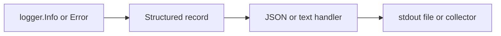

# CH-03: Structured Logging with `slog`

## 1. Tahap 1: Source Alignment dan Judul

- **Source Link**: [log/slog package](https://pkg.go.dev/log/slog) | [Structured Logging with slog](https://go.dev/blog/slog)
- **Framing**: Logging modern bukan cuma soal mencetak teks. `slog` membuat log menjadi data terstruktur yang lebih mudah dicari, difilter, dan dihubungkan dengan sinyal observability lain.

## 2. Tahap 2: Konsep dan Rasionalitas

### Definisi
`log/slog` adalah paket logging terstruktur standar di Go yang merepresentasikan log sebagai record berisi level, message, dan kumpulan atribut key-value.

### Rasionalitas
Pola ini dipilih karena:

1. **Log lebih mudah diproses mesin**  
   Format JSON dan atribut terstruktur cocok untuk pipeline observability modern.
2. **Konteks lebih mudah dipertahankan**  
   Metadata seperti request ID, user ID, atau status bisa dibawa sebagai field, bukan ditempel di string mentah.
3. **Standar library memudahkan konsistensi**  
   Ekosistem Go punya titik temu logging yang lebih seragam.

### Analogi Model Mental
Bayangkan arsip kejadian di bandara. Log teks biasa seperti catatan bebas petugas. Structured logging seperti formulir standar dengan kolom waktu, gate, maskapai, dan status, sehingga semua data lebih mudah dicari ulang.

### Terminologi Teknis
- **Record**: unit log yang berisi message dan atribut.
- **Handler**: komponen yang menentukan bagaimana log diserialisasi dan dikirim.
- **Attributes**: pasangan key-value yang memberi konteks tambahan.

## 3. Tahap 3: Visualisasi Sistem

## 4. Tahap 4: Mekanisme Pembuktian

Saat logger dipanggil, `slog` membentuk record dari message, level, dan atribut yang disuplai. Record ini lalu diteruskan ke handler yang akan memformat dan menulisnya ke sink yang dituju. Karena atribut sudah terstruktur sejak awal, log lebih mudah diintegrasikan dengan sistem pencarian dan agregasi.

Nilai observability-nya untuk `RAK-03`:
- log berubah dari output teks menjadi data operasional;
- korelasi antar sistem observability jadi lebih mudah;
- engineer bisa menjaga konteks log tanpa membanjiri message string dengan format yang berantakan.

## 5. Tahap 5: Lab Praktis

Lihat pembuktian logging terstruktur di folder [examples/](./examples):
- [01-slog-json](./examples/01-slog-json) - Contoh konfigurasi `slog` dengan output JSON dan atribut terstruktur.

---
*Status: [x] Complete*
