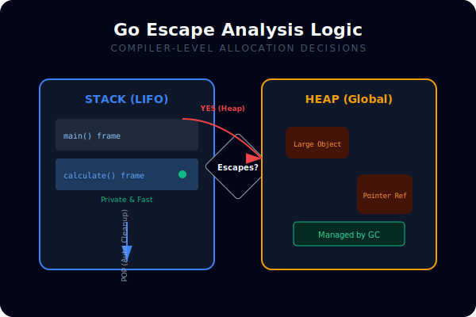
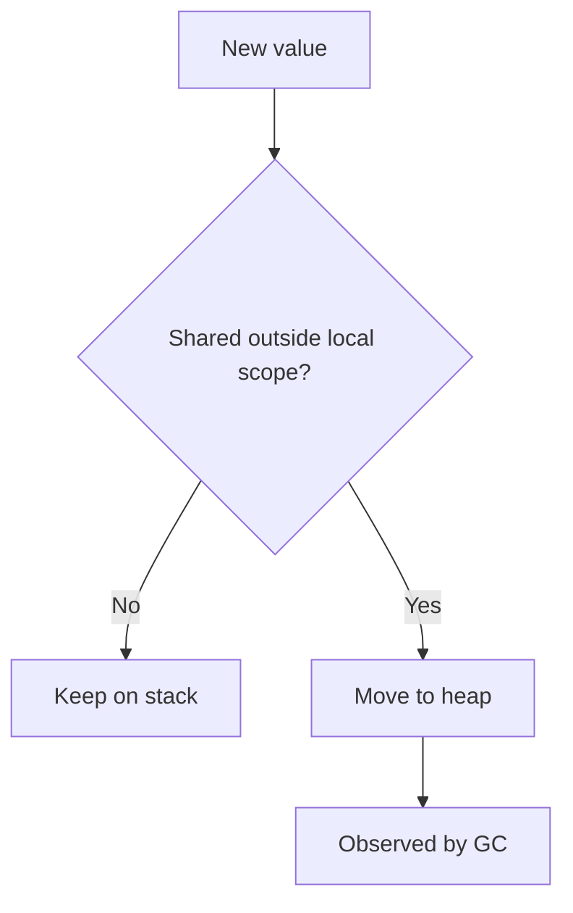

# CH-01: Escape Analysis

## 1. Tahap 1: Source Alignment dan Judul

- **Source Link**: [Go Wiki: Compiler Optimizations](https://go.dev/wiki/CompilerOptimizations) | [A Guide to the Go Garbage Collector](https://go.dev/doc/gc-guide)
- **Framing**: Escape analysis membantu menjawab pertanyaan yang sangat praktis: kapan sebuah nilai tetap murah di stack, dan kapan ia menjadi beban heap yang nanti harus dibersihkan GC.

## 2. Tahap 2: Konsep dan Rasionalitas

### Definisi
Escape analysis adalah analisis compiler untuk menentukan apakah sebuah nilai bisa hidup aman di stack atau harus dialokasikan di heap karena lifetime atau pola pemakaiannya melampaui konteks lokal.

### Rasionalitas
Topik ini penting karena:

1. **Heap allocation punya biaya nyata**  
   Saat nilai lolos ke heap, efeknya bukan cuma alokasi, tetapi juga beban untuk garbage collector.
2. **Desain API memengaruhi lokasi alokasi**  
   Mengembalikan pointer, menyimpan nilai ke interface, atau mengirim data ke goroutine lain bisa mengubah keputusan compiler.
3. **Output compiler jadi lebih mudah dibaca**  
   Engineer bisa memakai `-gcflags=-m` untuk memahami mengapa sebuah nilai "escapes".

### Analogi Model Mental
Bayangkan barang kerja sementara di meja pribadi. Selama barang itu tidak dibawa keluar ruangan, ia bisa tetap di meja. Begitu barang harus dibagikan ke area umum, ia harus dipindah ke gudang bersama.

### Terminologi Teknis
- **Stack Allocation**: alokasi lokal yang sangat murah dan dibersihkan otomatis saat frame selesai.
- **Heap Allocation**: alokasi yang dikelola runtime dan GC.
- **Escape**: kondisi saat lifetime nilai melampaui batas aman stack lokal.

## 3. Tahap 3: Visualisasi Sistem

## 4. Tahap 4: Mekanisme Pembuktian

Compiler Go menganalisis aliran nilai: apakah alamatnya dikembalikan, disimpan ke tempat yang lebih lama hidupnya, atau dipakai dengan cara yang tidak aman bila tetap di stack. Jika iya, nilai dipindah ke heap. Karena itu, escape analysis bukan tebakan runtime, tetapi keputusan kompilasi yang sangat memengaruhi performa.

Nilai praktisnya:
- membantu engineer membaca trade-off pointer vs value dengan lebih sadar;
- memperjelas hubungan antara desain kode dan GC pressure;
- membuat optimisasi memori terasa lebih mekanis, bukan mistis.

## 5. Tahap 5: Lab Praktis

Lihat pembuktian di folder [examples/](./examples):
- [01-escape-demo](./examples/01-escape-demo) - Contoh sederhana untuk membaca keputusan escape analysis dari output compiler.

---
*Status: [x] Complete*
