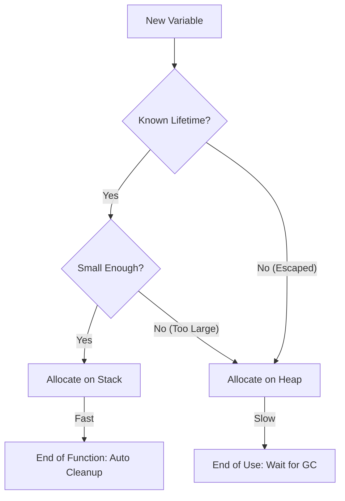

# [BK-01-CH-01] Heap vs Stack & Escape Analysis

**The Anatomy of Allocation**
*Target: Memahami kapan data diletakkan di Stack atau dipaksa ke Heap dalam waktu < 4 menit.*

## 1. Definisi & Konsep (The Logic)

Dalam Go, memori dibagi menjadi dua area utama: **Stack** (cepat, dikelola per-goroutine) dan **Heap** (lambat, dikelola oleh Garbage Collector). **Escape Analysis** adalah fase kompilasi di mana compiler memutuskan apakah suatu variabel "lolos" (escapes) dari fungsi dan harus dialokasikan di Heap.

### Terminologi Utama (Senior Terms)
- **Stack Allocation**: Sangat cepat (hanya menggerakkan pointer stack), memori otomatis bersih saat fungsi selesai.
- **Heap Allocation**: Lebih lambat, menambah beban Garbage Collector (GC), dan berisiko fragmentasi.
- **Escape Analysis**: Algoritma statis compiler untuk menentukan masa hidup (lifetime) sebuah variabel.
- **Pointer Indirection**: Salah satu pemicu utama variabel pindah ke heap jika pointer-nya dikirim keluar fungsi.

## 2. Rasionalitas (Why & How?)

Mengapa Anda harus peduli ke mana variabel dialokasikan?
- **Performance**: Alokasi stack hampir gratis secara komputasi. Mengurangi alokasi heap secara drastis meningkatkan *throughput* aplikasi.
- **GC Pressure**: Semakin sedikit objek di heap, semakin jarang GC perlu berjalan, mengurangi latensi "Stop The World".
- **Mechanical Sympathy**: Menulis kode yang ramah terhadap cara kerja compiler Go.

### Mekanisme Kerja Under-the-Hood
Pemicu umum alokasi Heap (Escaping):
1. **Sharing Up**: Mengirim pointer ke variabel lokal keluar dari fungsi (return pointer).
2. **Sharing Down**: Mengirim pointer ke interface (karena tipe data di dalam interface tidak diketahui saat kompilasi).
3. **Large Objects**: Variabel yang ukurannya terlalu besar untuk masuk ke stack limit (biasanya ~2GB total, tapi per-object limit lebih kecil).
4. **Dynamic Size**: Variabel yang ukurannya ditentukan saat runtime (misal: `make([]byte, n)`).

## 3. Implementasi Utama (The Lab)

Lihat investigasi compiler di [examples/](./examples/).
1. `01-escape-demo`: Gunakan perintah `go build -gcflags="-m"` untuk melihat laporan rahasia compiler tentang nasib setiap variabel.

## 4. Model Mental Visual (The Assets)

### Allocation Flow Decision

---
*Back to [SR-05 Page](../../README.md)*
