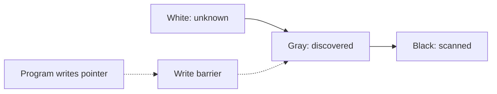

# CH-02: Garbage Collector Deep Dive

## 1. Tahap 1: Source Alignment dan Judul

- **Source Link**: [A Guide to the Go Garbage Collector](https://go.dev/doc/gc-guide) | [runtime package](https://pkg.go.dev/runtime)
- **Framing**: GC Go dirancang supaya aplikasi tetap berjalan sambil pembersihan memori berlangsung, tetapi biaya dan ritmenya tetap perlu dipahami oleh engineer yang peduli latency dan throughput.

## 2. Tahap 2: Konsep dan Rasionalitas

### Definisi
Garbage collector Go adalah collector konkuren yang memakai model mark-and-sweep dengan pacing, write barrier, dan fase singkat stop-the-world pada titik-titik tertentu.

### Rasionalitas
Topik ini penting karena:

1. **GC memengaruhi latency aplikasi**  
   Semakin banyak heap aktif dan alokasi baru, semakin penting memahami kapan GC bekerja lebih keras.
2. **Trade-off throughput vs memory jadi lebih jelas**  
   Menekan GC terlalu agresif atau terlalu longgar sama-sama punya biaya.
3. **Engineer jadi lebih paham efek pola alokasi**  
   Topik ini menghubungkan desain objek, reuse, dan pressure pada heap.

### Analogi Model Mental
Bayangkan petugas kebersihan mal yang bekerja saat mal tetap buka. Mereka terus menandai area yang masih dipakai, membersihkan yang sudah tidak dipakai, dan sesekali menahan arus singkat agar penandaan tetap konsisten.

### Terminologi Teknis
- **Tri-Color Marking**: model objek putih, abu-abu, dan hitam saat proses marking.
- **Write Barrier**: mekanisme agar perubahan pointer tetap aman saat GC berjalan konkuren.
- **Pacing**: cara runtime mengatur ritme kerja GC terhadap laju alokasi.

## 3. Tahap 3: Visualisasi Sistem

## 4. Tahap 4: Mekanisme Pembuktian

Runtime Go menyeimbangkan kerja aplikasi dan kerja collector. Objek ditandai, lalu disapu ketika sudah dipastikan tidak lagi dirujuk. Karena proses ini berjalan beriringan dengan program, write barrier dan pacing sangat penting untuk menjaga konsistensi tanpa membuat aplikasi berhenti lama.

Nilai praktisnya:
- membantu pembaca membaca `gctrace` dan `MemStats` dengan lebih percaya diri;
- menjelaskan mengapa alokasi berlebihan sering berubah menjadi masalah latency;
- menjadi jembatan penting menuju optimisasi memori yang lebih sadar risiko.

## 5. Tahap 5: Lab Praktis

Lihat pembuktian di folder [examples/](./examples):
- [01-gc-trace](./examples/01-gc-trace) - Program kecil untuk melihat jejak perilaku GC saat beban alokasi dinaikkan.

---
*Status: [x] Complete*
