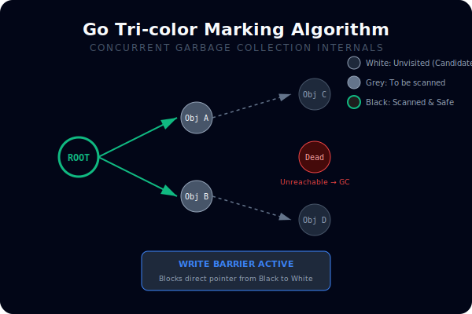
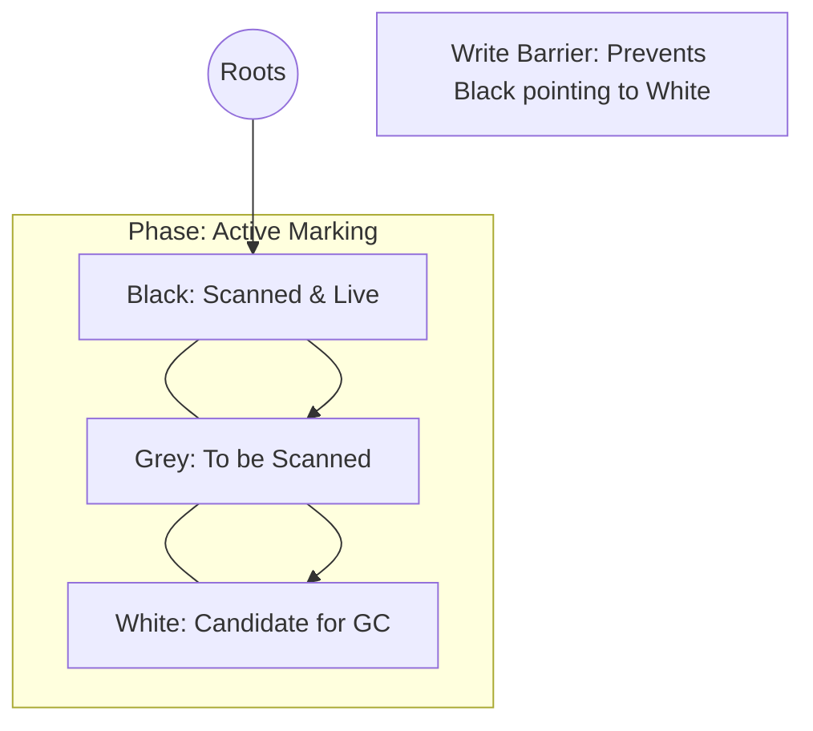

# [BK-01-CH-02] Garbage Collection Deep Dive

**Mastering the Tri-Color Mark & Sweep**
*Target: Memahami bagaimana Go membersihkan memori tanpa jeda panjang (STW) dalam waktu < 4 menit.*

## 1. Definisi & Konsep (The Logic)

Garbage Collector (GC) Go adalah kolektor **Concurrent, Tri-color, Mark-and-Sweep**. Tujuannya adalah membebaskan memori yang tidak lagi dirujuk oleh stack atau variabel global. GC Go dioptimalkan untuk **Low Latency**, bukan throughput maksimal, dengan cara menjalankan sebagian besar pekerjaannya secara konkuren bareng aplikasi.

### Terminologi Utama (Senior Terms)
- **STW (Stop The World)**: Fase singkat di mana seluruh goroutine dihentikan (untuk memulai marking dan mengakhiri marking).
- **Tri-color Marking**: Algoritma yang membagi objek menjadi 3 warna: Putih (kandidat hapus), Abu-abu (sedang diproses), dan Hitam (aman/terpakai).
- **Write Barrier**: Kode kecil yang disisipkan compiler saat program berjalan untuk memastikan integritas "warna" saat objek dipindahkan selama fase marking.
- **Pacing**: Logika runtime untuk menentukan kapan GC harus mulai berjalan berdasarkan target CPU usage (default: 25%) dan pertumbuhan heap.

## 2. Rasionalitas (Why & How?)

Mengapa desain GC Go berbeda dari Java?
- **Predictability**: Go lebih memilih jeda yang sangat singkat (< 1ms) secara konsisten daripada jeda panjang sesekali.
- **No Compaction**: Go jarang memindahkan objek di heap (non-moving GC), yang memudahkan integrasi dengan kode C/C++ via cgo.
- **Efficiency**: Menggunakan GOMEMLIMIT (sejak 1.19) untuk menghindari GC thrashing saat memori hampir penuh.

### Mekanisme Kerja Under-the-Hood (The Colors)
1. **Initial STW**: Menyalakan Write Barrier dan menandai "Roots" (stack, global) sebagai Abu-abu.
2. **Concurrent Marking**: Pindai objek Abu-abu, ubah jadi Hitam, dan tandai anak-anaknya sebagai Abu-abu. Melibatkan "Mark Assist" jika aplikasi mengalokasi terlalu cepat.
3. **Finish STW**: Finalisasi marking dan pembersihan stack.
4. **Concurrent Sweeping**: Membebaskan memori Putih kembali ke allocator.

## 3. Implementasi Utama (The Lab)

Lihat inspeksi GC di [examples/](./examples/).
1. `01-gc-trace`: Program alokasi tinggi. Gunakan `GODEBUG=gctrace=1` untuk melihat detail durasi STW dan utilisasi CPU oleh GC.

## 4. Model Mental Visual (The Assets)

### Tri-color Marking Process

---
*Back to [SR-05 Page](../../README.md)*
