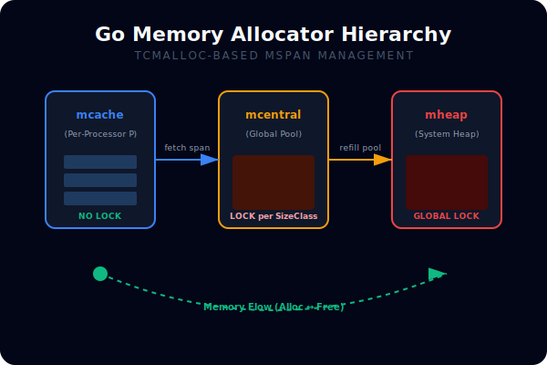
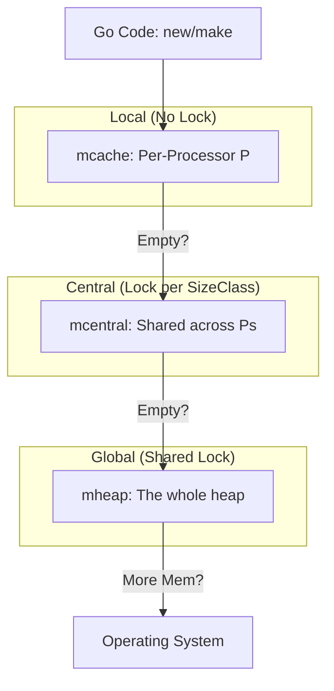

# [BK-01-CH-03] Memory Allocator Architecture

**The TCMalloc Inheritance**
*Target: Memahami bagaimana Go membagi-bagi memori ke dalam span untuk alokasi super cepat dalam waktu < 4 menit.*

## 1. Definisi & Concepts (The Logic)

Allocator Go didasarkan pada **TCMalloc** (Thread-Caching Malloc). Alih-alih satu blok memori besar, Go membagi memori menjadi unit-unit kecil yang disebut **mspan**. Struktur ini berjenjang untuk meminimalkan lock contention antar thread saat melakukan alokasi.

### Terminologi Utama (Senior Terms)
- **mspan**: Unit dasar pengelolaan memori yang berisi satu atau lebih halaman (8KB).
- **mcache**: Cache memori lokal per-Processor (P). Alokasi kecil (<32KB) diambil dari sini tanpa lock.
- **mcentral**: Penampung mspan global untuk ukuran objek tertentu. Digunakan jika mcache kosong.
- **mheap**: Struktur data pusat yang mengelola seluruh heap Go dan meminta memori dari OS.
- **Size Classes**: Go memiliki ~67 kategori ukuran objek untuk meminimalkan fragmentasi internal.

## 2. Rasionalitas (Why & How?)

Mengapa desain hierarki ini sangat penting?
- **Speed**: Sebagian besar alokasi terjadi di `mcache` (local), yang berarti tidak ada overhead mutex antar thread.
- **Anti-Fragmentation**: Dengan menggunakan Size Classes, Go memastikan objek dengan ukuran mirip diletakkan berdampingan, menjaga memori tetap padat.
- **Scalability**: Performa alokasi tetap stabil seiring bertambahnya jumlah core CPU (P).

### Mekanisme Kerja Under-the-Hood
1. **Tiny Aloc (<16B)**: Digabungkan ke dalam satu blok 16-byte di mcache.
2. **Small Alloc (16B - 32KB)**: Diambil dari daftar mspan yang sesuai di mcache.
3. **Large Alloc (>32KB)**: Langsung dialokasikan dari mheap dengan lock global.

## 3. Implementasi Utama (The Lab)

Lihat visualisasi konsumsi memori internal di [examples/](./examples/).
1. `01-mem-stats`: Menggunakan `runtime.MemStats` untuk mengintip jumlah span yang aktif dan memori yang dipesan (Sys) vs yang terpakai (Alloc).

## 4. Model Mental Visual (The Assets)

### Go Allocator Hierarchy

---
*Back to [SR-05 Page](../../README.md)*
