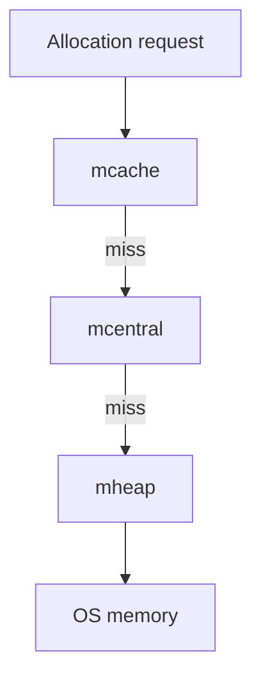

# CH-03: Runtime Allocator

## 1. Tahap 1: Source Alignment dan Judul

- **Source Link**: [runtime package](https://pkg.go.dev/runtime) | [A Guide to the Go Garbage Collector](https://go.dev/doc/gc-guide)
- **Framing**: Untuk memahami performa alokasi Go, kita perlu tahu bahwa permintaan memori tidak selalu langsung pergi ke heap global. Ada jalur bertingkat yang dirancang agar alokasi umum tetap cepat.

## 2. Tahap 2: Konsep dan Rasionalitas

### Definisi
Allocator runtime Go mengelola memori lewat lapisan cache dan span, sehingga alokasi kecil bisa dilayani dekat dengan eksekusi goroutine, sementara koordinasi yang lebih berat hanya terjadi saat benar-benar perlu.

### Rasionalitas
Topik ini penting karena:

1. **Menjelaskan mengapa alokasi kecil sering tetap cepat**  
   Tidak semua alokasi langsung berarti akses berat ke struktur global.
2. **Membantu membaca hubungan allocator dan GC**  
   Heap growth, reuse, dan sweeping saling terkait.
3. **Membuat metrik memori lebih masuk akal**  
   Engineer jadi lebih mudah menghubungkan perilaku aplikasi dengan statistik runtime.

### Analogi Model Mental
Bayangkan sistem logistik dengan gudang kecil di tiap cabang, gudang regional, lalu gudang pusat. Permintaan barang kecil dilayani dulu dari stok terdekat agar cepat, baru naik ke tingkat yang lebih tinggi kalau stok lokal habis.

### Terminologi Teknis
- **mcache**: cache lokal yang melayani banyak alokasi kecil dengan cepat.
- **mcentral**: pool bersama untuk kelas ukuran tertentu.
- **mheap / span**: area yang mengelola blok memori dari tingkat yang lebih global.

## 3. Tahap 3: Visualisasi Sistem

## 4. Tahap 4: Mekanisme Pembuktian

Allocator Go memprioritaskan jalur lokal agar alokasi kecil tidak perlu terus berebut lock global. Saat cache lokal kehabisan span yang cocok, runtime meminta ke lapisan yang lebih tinggi. Model bertingkat ini menjaga banyak alokasi umum tetap cepat, tetapi juga tetap terhubung dengan sistem sweeping dan GC yang membersihkan heap.

Nilai praktisnya:
- membantu menjelaskan kenapa pola alokasi tertentu terasa lebih mahal;
- memberi konteks terhadap statistik heap dan perilaku GC;
- menjadi dasar pemahaman sebelum masuk ke internals runtime yang lebih dalam.

## 5. Tahap 5: Lab Praktis

Lihat pembuktian di folder [examples/](./examples):
- [01-mem-stats](./examples/01-mem-stats) - Contoh kecil untuk melihat statistik alokasi runtime dan perubahan heap saat program berjalan.

---
*Status: [x] Complete*
