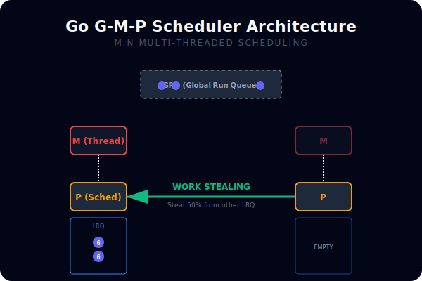
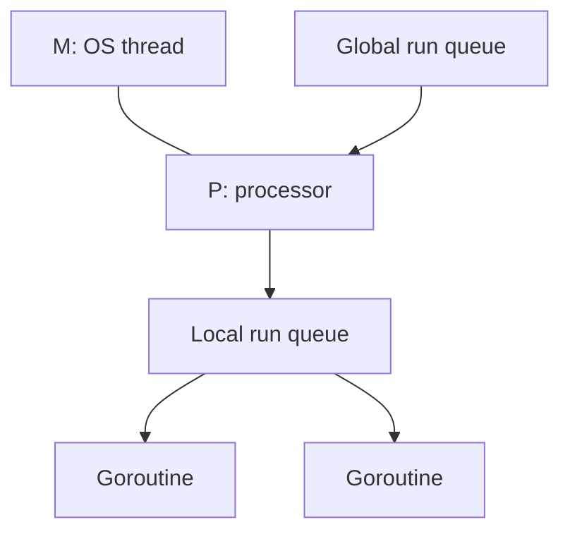

# CH-01: G-M-P Scheduler Model

## 1. Tahap 1: Source Alignment dan Judul

- **Source Link**: [runtime package](https://pkg.go.dev/runtime) | [runtime.GOMAXPROCS](https://pkg.go.dev/runtime#GOMAXPROCS)
- **Framing**: Model G-M-P menjelaskan mengapa Go bisa menjalankan banyak goroutine tanpa harus membuat satu thread OS untuk masing-masing pekerjaan.

## 2. Tahap 2: Konsep dan Rasionalitas

### Definisi
Scheduler Go memakai tiga aktor utama: **G** untuk goroutine, **M** untuk thread OS, dan **P** untuk resource logis yang memungkinkan goroutine dijalankan. Kombinasi ketiganya membuat runtime bisa menjadwalkan banyak goroutine di atas jumlah thread yang lebih terbatas.

### Rasionalitas
Topik ini penting karena:

1. **Menjelaskan skalabilitas goroutine**  
   Ribuan goroutine bisa dikelola tanpa biaya satu-thread-per-task.
2. **Membantu membaca efek `GOMAXPROCS`**  
   Jumlah `P` memengaruhi seberapa banyak kerja CPU-bound bisa benar-benar paralel.
3. **Membuka pemahaman tentang work stealing**  
   Scheduler tidak sekadar antrean tunggal, tetapi sistem distribusi kerja yang aktif.

### Analogi Model Mental
Bayangkan dapur besar: pesanan adalah `G`, koki adalah `M`, dan stasiun kerja aktif adalah `P`. Koki hanya bisa memasak jika punya stasiun kerja. Jika satu stasiun kehabisan pesanan, ia bisa mengambil dari stasiun lain.

### Terminologi Teknis
- **Local Run Queue**: antrean goroutine lokal milik sebuah `P`.
- **Global Run Queue**: antrean global saat kerja belum terikat ke `P` tertentu.
- **Work Stealing**: pengambilan kerja dari `P` lain saat antrean lokal kosong.

## 3. Tahap 3: Visualisasi Sistem

## 4. Tahap 4: Mekanisme Pembuktian

Saat sebuah goroutine dibuat, scheduler mencoba menaruhnya ke antrean lokal `P` yang aktif. `M` menjalankan `G` lewat `P` yang sedang dipegangnya. Jika satu `P` kehabisan kerja, runtime bisa mencuri sebagian kerja dari antrean `P` lain agar CPU tetap terpakai merata.

Nilai praktisnya:
- membantu memahami mengapa concurrency Go terasa ringan;
- memberi konteks saat membaca performa CPU-bound vs I/O-bound;
- menjadi dasar sebelum masuk ke topik blocking syscall dan preemption.

## 5. Tahap 5: Lab Praktis

Lihat pembuktian di folder [examples/](./examples):
- [01-gmp-visual](./examples/01-gmp-visual) - Contoh kecil untuk melihat hubungan `GOMAXPROCS`, goroutine, dan pembagian kerja scheduler.

---
*Status: [x] Complete*
