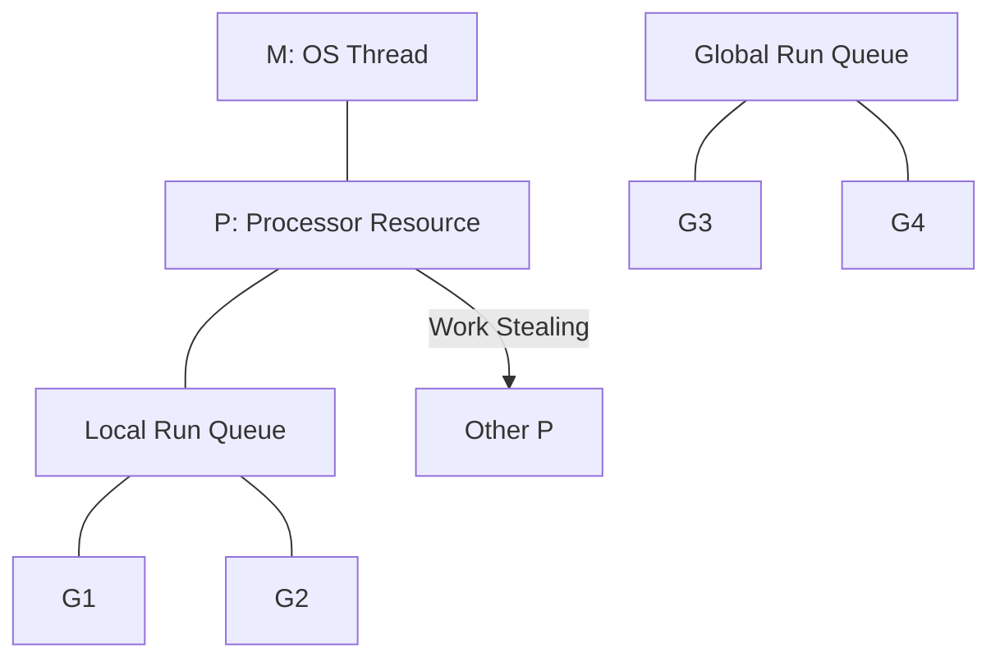

# [BK-02-CH-01] G-M-P Model & Work Stealing

**The Engine Behind Concurrency**
*Target: Memahami bagaimana 1 juta goroutine bisa berjalan di atas 8 core CPU dalam waktu < 4 menit.*

## 1. Definisi & Konsep (The Logic)

Runtime Go menggunakan model penjadwalan **M:N**, di mana M goroutine dipetakan ke N thread sistem operasi. Struktur ini dikelola melalui tiga entitas utama yang disebut **G-M-P**.

### Terminologi Utama (Senior Terms)
- **G (Goroutine)**: Unit eksekusi terkecil (mirip thread tapi sangat ringan, ~2KB stack awal).
- **M (Machine)**: Thread Sistem Operasi (OS Thread). M menjalankan kode Go tapi harus memiliki P.
- **P (Processor)**: Resource yang dibutuhkan oleh M untuk mengeksekusi G. Jumlah P dibatasi oleh `GOMAXPROCS`.
- **LRQ (Local Run Queue)**: Antrean goroutine lokal milik setiap P.
- **GRQ (Global Run Queue)**: Antrean goroutine global untuk G yang belum masuk ke P manapun.

## 2. Rasionalitas (Why & How?)

Mengapa Go tidak menggunakan thread OS secara langsung?
- **Context Switch Fast**: Berpindah antar goroutine jauh lebih murah daripada berpindah antar thread OS karena dilakukan di user space.
- **Efficient Scaling**: Ribuan goroutine bisa "mengantre" di satu P, menghindari overhead manajemen ribuan thread di kernel.
- **Work Stealing**: Jika satu P kehabisan pekerjaan (LRQ kosong), dia akan "mencuri" 50% goroutine dari LRQ milik P lain untuk menjaga utilitas CPU tetap tinggi.

### Mekanisme Kerja Under-the-Hood
1. **Creation**: Saat `go func()` dipanggil, G baru dimasukkan ke LRQ milik P saat ini.
2. **Execution**: M mengambil G dari LRQ milik P yang sedang dipegangnya dan mengeksekusinya.
3. **Blocking**: Jika G melakukan syscall yang memblokir, M akan melepaskan P agar P bisa digunakan oleh thread (M) lain untuk menjalankan goroutine lain.

## 3. Implementasi Utama (The Lab)

Lihat pengaruh GOMAXPROCS di [examples/](./examples/).
1. `01-gmp-visual`: Program yang mensimulasikan beban kerja tinggi dan menunjukkan bagaimana runtime membagi tugas antar-Processor (P).

## 4. Model Mental Visual (The Assets)

### G-M-P Relationship

---
*Back to [SR-05 Page](../../README.md)*
