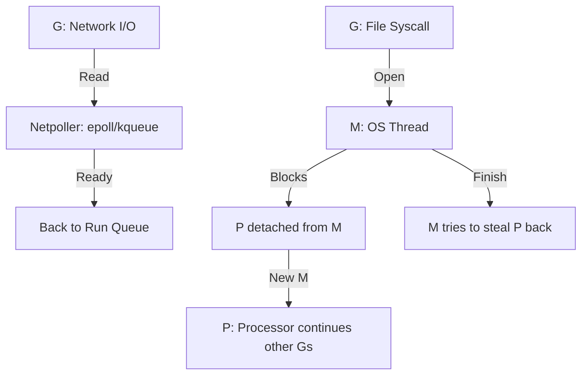

# [BK-02-CH-02] Syscall Handling & Network Poller

**The High-Concurrency Secret Sauce**
*Target: Memahami bagaimana Go menangani ribuan koneksi jaringan tanpa ribuan thread sistem dalam waktu < 4 menit.*

## 1. Definisi & Konsep (The Logic)

Aplikasi Go sering melakukan operasi I/O (Jaringan atau File). Go menangani dua jenis blocking ini dengan cara berbeda: **Netpoller** untuk operasi jaringan asinkron dan **Syscall Handoff** untuk operasi file/sistem sinkron.

### Terminologi Utama (Senior Terms)
- **Netpoller**: Komponen runtime yang menggunakan mekanisme kernel (seperti `epoll`, `kqueue`, atau `iocp`) untuk memantau banyak koneksi jaringan dalam satu thread.
- **Syscall Handoff**: Proses di mana M (Thread) melepaskan P (Processor) saat melakukan syscall sinkron yang memblokir, sehingga P bisa lanjut menjalankan G (Goroutine) lain dengan M baru.
- **Re-acquisition**: Saat syscall selesai, M akan mencoba mengambil P kembali atau meletakkan G ke Global Run Queue jika P tidak tersedia.

## 2. Rasionalitas (Why & How?)

Mengapa desain ini membuat Go sangat cepat untuk server I/O?
- **Efficient Network I/O**: Goroutine yang menunggu data jaringan "diparkir" di Netpoller. Thread (M) tidak memblokir, sehingga satu M bisa menangani ribuan G yang sedang menunggu jaringan.
- **Thread Management**: Go secara otomatis menambah Thread OS (M) jika banyak syscall sinkron (seperti pembacaan file besar) terjadi secara bersamaan, memastikan program tetap responsif.
- **Resource Savings**: Menghindari overhead memori dan context-switching ribuan thread OS yang memblokir.

### Mekanisme Kerja Under-the-Hood
1. **Network Wait**: G memanggil `net.Conn.Read()`. Runtime mengubah G menjadi status `waiting` dan mendaftarkannya ke Netpoller.
2. **M Handoff**: G memanggil syscall sinkron. M memblokir di kernel. Runtime (sysmon) mendeteksi M memblokir, memisahkan P dari M, dan mencari/membuat M baru untuk P.
3. **Netpoller Wakeup**: Netpoller mendeteksi data masuk. Dia memindahkan G kembali ke Run Queue agar bisa dijadwalkan lagi oleh P yang tersedia.

## 3. Implementasi Utama (The Lab)

Lihat perilaku thread saat blocking di [examples/](./examples/).
1. `01-syscall-blocking`: Eksperimen yang menunjukkan bagaimana jumlah Thread OS meningkat saat banyak goroutine melakukan operasi file yang sinkron secara bersamaan.

## 4. Model Mental Visual (The Assets)

### Netpoller vs Syscall Flow

---
*Back to [SR-05 Page](../../README.md)*
