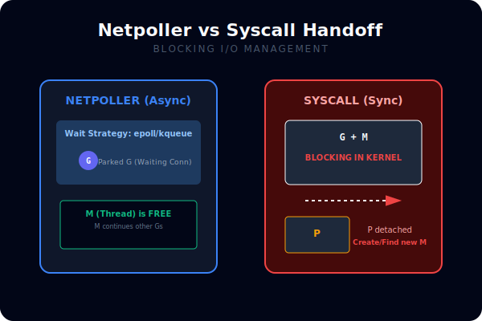
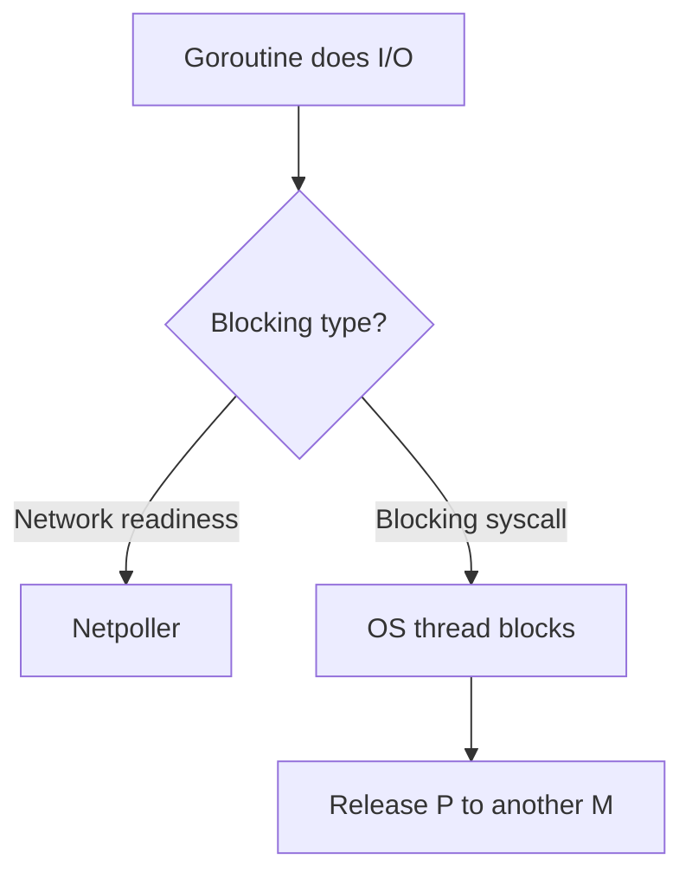

# CH-02: Blocking Syscalls and Netpoller

## 1. Tahap 1: Source Alignment dan Judul

- **Source Link**: [runtime package](https://pkg.go.dev/runtime) | [net package](https://pkg.go.dev/net)
- **Framing**: Tidak semua operasi blocking diperlakukan sama oleh runtime. Memahami perbedaan blocking syscall biasa dan I/O berbasis netpoller membantu membaca perilaku scheduler dengan lebih realistis.

## 2. Tahap 2: Konsep dan Rasionalitas

### Definisi
Saat goroutine melakukan operasi yang memblokir, runtime harus memutuskan apakah thread OS akan benar-benar tertahan atau apakah kerja itu bisa dipantau dengan mekanisme seperti netpoller agar scheduler tetap lincah.

### Rasionalitas
Topik ini penting karena:

1. **Menjelaskan kenapa network I/O terasa lebih ramah scheduler**  
   Banyak operasi jaringan tidak memonopoli thread OS dengan cara yang sama seperti blocking syscall biasa.
2. **Membantu membaca bottleneck I/O**  
   Tidak semua "macet" di aplikasi berarti scheduler rusak; kadang bentuk blocking-nya memang berbeda.
3. **Menghubungkan concurrency dengan perilaku runtime nyata**  
   Goroutine ringan tetap berjalan di atas fondasi OS yang punya batas.

### Analogi Model Mental
Bayangkan dua jenis antrean bantuan. Satu antrean mengharuskan petugas berdiri dan menunggu pelanggan sampai selesai. Antrean lain cukup mencatat nomor tiket, lalu petugas bisa membantu orang lain sambil menunggu sinyal siap.

### Terminologi Teknis
- **Blocking Syscall**: panggilan ke OS yang bisa menahan thread sampai operasi selesai.
- **Netpoller**: mekanisme runtime untuk memantau readiness I/O tertentu.
- **Syscall Handoff**: pelepasan `P` agar kerja lain tetap bisa berjalan saat sebuah `M` tertahan.

## 3. Tahap 3: Visualisasi Sistem

## 4. Tahap 4: Mekanisme Pembuktian

Untuk I/O yang bisa diintegrasikan dengan readiness polling, runtime dapat menahan goroutine tanpa benar-benar mematikan kelincahan scheduler. Namun untuk blocking syscall biasa, thread OS bisa tertahan lebih keras, sehingga runtime perlu melepas `P` agar goroutine lain tetap bisa maju di thread berbeda.

Nilai praktisnya:
- membantu menjelaskan kenapa workload network dan workload syscall lokal bisa terasa berbeda;
- memberi konteks pada fenomena "goroutine banyak, tapi progress sedikit";
- memperjelas hubungan antara runtime scheduler dan dunia OS.

## 5. Tahap 5: Lab Praktis

Lihat pembuktian di folder [examples/](./examples):
- [01-syscall-blocking](./examples/01-syscall-blocking) - Contoh kecil untuk membaca efek blocking call terhadap aliran eksekusi dan observasi scheduler.

---
*Status: [x] Complete*
