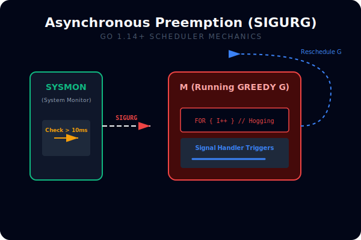
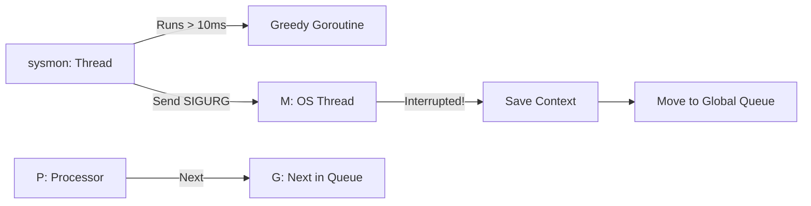

# [BK-02-CH-03] Preemption Mechanisms

**Preventing Greedy Goroutines**
*Target: Memahami bagaimana Go memutus jalan goroutine yang "rakus" CPU agar program tetap responsif dalam waktu < 4 menit.*

## 1. Definisi & Konsep (The Logic)

Dalam sistem multitasking, **Preemption** adalah tindakan menjeda paksa sebuah proses untuk memberikan giliran pada proses lain. Go memiliki dua evolusi utama dalam preemption: **Cooperative Preemption** (Go < 1.14) dan **Asynchronous Preemption** (Go 1.14+).

### Terminologi Utama (Senior Terms)
- **Cooperative Preemption**: Goroutine hanya bisa berhenti jika dia mencapai "Safe Point" (biasanya panggilan fungsi di mana compiler menyisipkan pengecekan stack).
- **Asynchronous Preemption**: Runtime bisa menjeda goroutine kapan saja menggunakan sinyal OS (misal: `SIGURG` di Unix) tanpa menunggu safe point.
- **Sysmon (System Monitor)**: Thread latar belakang khusus yang memantau goroutine yang berjalan terlalu lama (> 10ms) dan mengirimkan sinyal preemption.

## 2. Rasionalitas (Why & How?)

Mengapa perubahan ke Asynchronous Preemption sangat krusial?
- **Tight Loops**: Di Go versi lama, sebuah loop yang tidak memanggil fungsi apapun (`for { i++ }`) bisa mengunci satu Processor (P) selamanya, menyebabkan deadlocks atau degradasi performa masif.
- **GC Responsiveness**: Garbage Collector seringkali perlu menghentikan goroutine (STW) untuk mulai bekerja. Jika ada satu goroutine yang tidak kooperatif, GC bisa tertunda lama.
- **Improved Fairness**: Memastikan seluruh goroutine mendapatkan jatah CPU yang adil tanpa harus "memohon" ke compiler.

### Mekanisme Kerja Under-the-Hood (Go 1.14+)
1. **Detection**: `sysmon` melihat G berjalan di P yang sama selama lebih dari 10 milidetik.
2. **Signaling**: `sysmon` mengirimkan sinyal `SIGURG` (di Linux/macOS) ke thread (M) yang sedang menjalankan G tersebut.
3. **Interruption**: Handler sinyal di M akan menghentikan eksekusi G, menyimpan konteksnya, dan memasukkan G kembali ke Global Run Queue.
4. **Reschedule**: P sekarang bebas untuk mengambil G lain dari Local Run Queue.

## 3. Implementasi Utama (The Lab)

Lihat pembuktian preemption di [examples/](./examples/).
1. `01-tight-loop`: Sebuah loop tanpa akhir yang sengaja dibuat "rakus". Di Go 1.14+, program ini tidak akan mengunci seluruh aplikasi karena preemption asinkron.

## 4. Model Mental Visual (The Assets)

### Asynchronous Preemption (SIGURG)

---
*Back to [SR-05 Page](../../README.md)*
