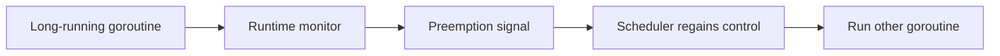

# CH-03: Preemption and Scheduler Fairness

## 1. Tahap 1: Source Alignment dan Judul

- **Source Link**: [Go 1.14 Release Notes](https://go.dev/doc/go1.14) | [runtime package](https://pkg.go.dev/runtime)
- **Framing**: Preemption penting saat satu goroutine terlalu rakus memakai CPU. Tanpa mekanisme ini, scheduler akan kesulitan menjaga fairness di bawah beban berat.

## 2. Tahap 2: Konsep dan Rasionalitas

### Definisi
Preemption adalah kemampuan runtime untuk menghentikan sementara goroutine yang sedang berjalan agar goroutine lain juga mendapat kesempatan CPU. Di Go modern, ini tidak hanya mengandalkan titik kooperatif, tetapi juga punya bentuk preemption yang lebih agresif.

### Rasionalitas
Topik ini penting karena:

1. **Fairness scheduler jadi lebih baik**  
   Loop CPU-bound yang panjang tidak mudah memonopoli core terlalu lama.
2. **Latency sistem lebih terjaga**  
   Goroutine lain tidak harus menunggu titik yield yang mungkin datang terlambat.
3. **Engineer lebih paham perilaku runtime di workload berat**  
   Ini menjelaskan kenapa program tetap bisa responsif meski ada jalur komputasi yang rakus.

### Analogi Model Mental
Bayangkan moderator diskusi yang memotong pembicara yang terlalu lama agar peserta lain tetap mendapat giliran. Itu esensi fairness yang dibawa preemption ke scheduler.

### Terminologi Teknis
- **Cooperative Preemption**: pergantian yang terjadi saat goroutine mencapai titik yang ramah scheduler.
- **Asynchronous Preemption**: interupsi yang lebih aktif untuk mencegah loop rakus mengunci CPU.
- **Fairness**: pembagian kesempatan CPU yang lebih seimbang antar goroutine.

## 3. Tahap 3: Visualisasi Sistem

## 4. Tahap 4: Mekanisme Pembuktian

Runtime memantau goroutine yang terlalu lama aktif di CPU. Saat perlu, runtime memicu mekanisme preemption agar kontrol kembali ke scheduler. Dengan begitu, program tidak sepenuhnya bergantung pada kemauan kode aplikasi untuk "mengalah" secara manual.

Nilai praktisnya:
- membantu menjelaskan perilaku loop CPU-bound;
- memperjelas mengapa Go modern lebih tahan terhadap starvation;
- menyiapkan pembaca untuk memahami runtime behavior yang lebih dalam di `RAK-06`.

## 5. Tahap 5: Lab Praktis

Lihat pembuktian di folder [examples/](./examples):
- [01-tight-loop](./examples/01-tight-loop) - Contoh loop ketat untuk mengamati bagaimana runtime menjaga fairness eksekusi.

---
*Status: [x] Complete*
