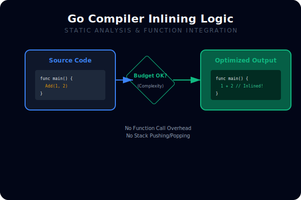
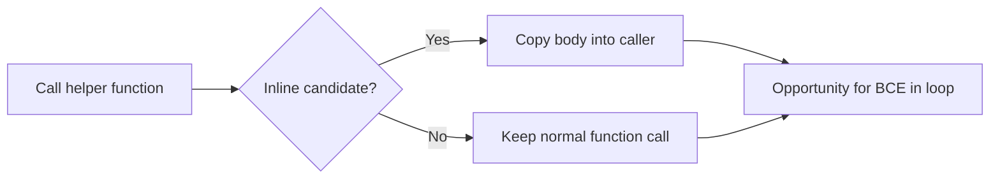

# CH-01: Inlining and Bounds Check Elimination

## 1. Tahap 1: Source Alignment dan Judul

- **Source Link**: [Go Wiki: Compiler Optimizations](https://go.dev/wiki/CompilerOptimizations) | [cmd/compile](https://pkg.go.dev/cmd/compile)
- **Framing**: Banyak optimisasi Go yang paling terasa justru terjadi sebelum program jalan. Inlining dan BCE membantu kode tetap rapi tanpa membayar overhead yang sebenarnya bisa dihapus compiler.

## 2. Tahap 2: Konsep dan Rasionalitas

### Definisi
**Inlining** adalah saat compiler memasukkan isi fungsi kecil langsung ke lokasi pemanggilan. **Bounds Check Elimination (BCE)** adalah saat compiler membuktikan indeks pasti aman sehingga pengecekan batas array atau slice tidak perlu dijalankan terus-menerus.

### Rasionalitas
Pola ini penting karena:

1. **Abstraksi kecil tidak selalu mahal**  
   Fungsi helper yang sederhana sering tetap murah karena bisa di-inline.
2. **Loop panas bisa jadi lebih efisien**  
   BCE mengurangi cabang tambahan di jalur yang sering dieksekusi.
3. **Engineer bisa menulis kode yang lebih ramah compiler**  
   Dengan tahu polanya, kita bisa menghindari struktur yang mempersulit optimisasi.

### Analogi Model Mental
Bayangkan instruksi kerja singkat yang ditempel langsung di meja operator, bukan harus menelepon supervisor setiap kali langkah itu dibutuhkan. Itu gambaran sederhananya inlining.

### Terminologi Teknis
- **Inlining Budget**: batas kompleksitas yang dipakai compiler untuk menilai apakah fungsi layak di-inline.
- **Bounds Check**: pengecekan bahwa indeks masih berada di dalam batas slice atau array.
- **Hot Path**: jalur eksekusi yang berjalan sangat sering dan sensitif terhadap overhead kecil.

## 3. Tahap 3: Visualisasi Sistem

## 4. Tahap 4: Mekanisme Pembuktian

Compiler Go menganalisis ukuran dan bentuk fungsi untuk memutuskan apakah inlining menguntungkan. Pada saat yang sama, compiler juga mencoba membuktikan bahwa indeks tertentu aman, sehingga pengecekan batas tidak perlu diulang di setiap iterasi.

Nilai praktisnya:
- membantu engineer membaca output `-gcflags=-m` dengan lebih bermakna;
- membuat optimisasi tidak terasa seperti tebakan buta;
- menunjukkan bahwa performa sering berasal dari kerja sama antara desain kode dan compiler.

## 5. Tahap 5: Lab Praktis

Lihat pembuktian di folder [examples/](./examples):
- [01-inline-verify](./examples/01-inline-verify) - Contoh kecil untuk membaca sinyal inlining dan BCE lewat output compiler.

---
*Status: [x] Complete*
