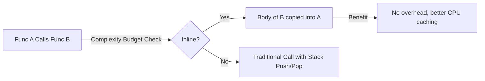

# [BK-03-CH-01] Inlining & Bounds Check Elimination (BCE)

**Compiler-Driven Performance Boosts**
*Target: Memahami bagaimana compiler Go menghapus overhead fungsi dan pengecekan array dalam waktu < 4 menit.*

## 1. Definisi & Konsep (The Logic)

Optimization dalam Go seringkali dilakukan oleh compiler tanpa intervensi manual yang besar. Dua teknik paling powerful adalah **Inlining** (memasukkan isi fungsi langsung ke pemanggil) dan **Bounds Check Elimination (BCE)** (menghapus pengecekan batas array yang tidak perlu).

### Terminologi Utama (Senior Terms)
- **Inlining**: Menghapus overhead panggilan fungsi (push/pop stack) dengan mengganti pemanggilan fungsi dengan body fungsi tersebut.
- **Leaf Function**: Fungsi kecil yang tidak memanggil fungsi lain, kandidat utama inlining.
- **BCE**: Proses di mana compiler membuktikan bahwa sebuah indeks pasti berada dalam batas array, sehingga instruksi pengecekan batas (panic check) bisa dihapus.
- **GC Flags**: Bendera compiler (`-gcflags`) untuk menampilkan laporan optimasi.

## 2. Rasionalitas (Why & How?)

Mengapa optimasi ini penting bagi Senior Developer?
- **Zero Overhead**: Inlining memungkinkan abstraksi kode (fungsi kecil) tetap rapi tanpa mengorbankan performa runtime.
- **CPU Cycle Savings**: BCE dapat mempercepat loop intensif (seperti pengolahan image atau kriptografi) dengan menghilangkan instruksi percabangan yang tidak perlu di setiap iterasi.
- **Mechanical Sympathy**: Menulis kode yang "mudah dioptimasi" oleh compiler (misal: struktur loop yang standar).

### Mekanisme Kerja Under-the-Hood
1. **Inlining Decision**: Compiler menghitung "budget" kompleksitas sebuah fungsi. Jika cukup sederhana, body fungsi di-*paste* ke lokasi pemanggilan.
2. **BCE Proof**: Jika Anda melakukan `_ = a[3]` sebelum loop yang mengakses `a[0...3]`, compiler tahu bahwa akses di dalam loop pasti aman dan akan menghapus cek batas internal.

## 3. Implementasi Utama (The Lab)

Lihat laporan optimasi compiler di [examples/](./examples/).
1. `01-inline-verify`: Gunakan perintah `go build -gcflags="-m -l"` untuk melihat fungsi mana yang di-*inline* dan di mana pengecekan batas array dihapus.

## 4. Model Mental Visual (The Assets)

### Inlining Optimization Logic

---
*Back to [SR-05 Page](../../README.md)*
