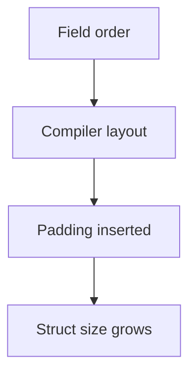

# CH-02: Alignment and Struct Padding

## 1. Tahap 1: Source Alignment dan Judul

- **Source Link**: [unsafe package](https://pkg.go.dev/unsafe) | [Go Wiki: Compiler Optimizations](https://go.dev/wiki/CompilerOptimizations)
- **Framing**: Layout struct yang terlihat sepele bisa membuat ukuran data membesar diam-diam. Alignment dan padding membantu kita membaca biaya itu dengan mata yang lebih tajam.

## 2. Tahap 2: Konsep dan Rasionalitas

### Definisi
Alignment adalah aturan bahwa field tertentu harus diletakkan pada batas alamat tertentu. Jika urutan field tidak cocok, compiler akan menambah **padding** agar alignment tetap benar.

### Rasionalitas
Topik ini penting karena:

1. **Ukuran struct bisa membengkak tanpa terlihat**  
   Urutan field yang kurang tepat menambah byte kosong yang tetap ikut dibawa ke memori.
2. **Efisiensi cache ikut terpengaruh**  
   Data yang lebih padat biasanya lebih ramah untuk cache dan throughput.
3. **Keputusan desain jadi lebih sadar biaya**  
   Engineer bisa memilih kapan perlu merapikan layout dan kapan tidak perlu terlalu agresif.

### Analogi Model Mental
Bayangkan rak barang dengan slot ukuran berbeda. Kalau kita menaruh barang besar-kecil secara acak, akan ada ruang kosong yang terbuang di antaranya. Padding adalah ruang kosong itu.

### Terminologi Teknis
- **Alignment Boundary**: batas alamat yang diinginkan suatu tipe.
- **Padding**: byte tambahan yang disisipkan compiler agar layout tetap valid.
- **Memory Footprint**: total ukuran data yang benar-benar dibawa di memori.

## 3. Tahap 3: Visualisasi Sistem

## 4. Tahap 4: Mekanisme Pembuktian

Compiler menghitung alignment setiap field lalu menyusun offset yang aman. Jika sebuah field butuh posisi yang lebih "rapi" di memori, compiler mengisi sela sebelumnya dengan padding. Karena itu, mengganti urutan field kadang cukup untuk mengecilkan ukuran struct tanpa mengubah perilaku logika program.

Nilai praktisnya:
- relevan saat struct dibuat sangat banyak;
- membantu membaca hasil `unsafe.Sizeof` dan `unsafe.Alignof`;
- mengajarkan bahwa desain data berpengaruh langsung ke biaya memori.

## 5. Tahap 5: Lab Praktis

Lihat pembuktian di folder [examples/](./examples):
- [01-padding-demo](./examples/01-padding-demo) - Contoh perbandingan layout struct untuk melihat efek urutan field terhadap ukuran akhir.

---
*Status: [x] Complete*
