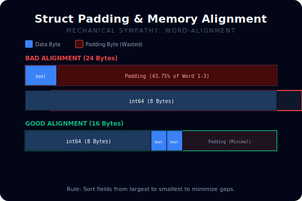
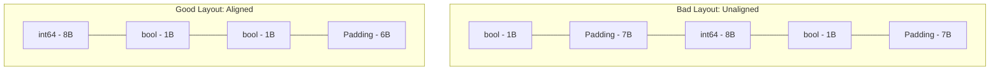

# [BK-03-CH-02] Data Alignment & Cache Efficiency

**The Art of Struct Layout**
*Target: Memahami bagaimana urutan variabel dalam struct memengaruhi penggunaan RAM dan kecepatan CPU dalam waktu < 4 menit.*

## 1. Definisi & Konsep (The Logic)

CPU modern tidak membaca memori per-byte, melainkan dalam blok yang disebut **Word** (biasanya 8 byte pada sistem 64-bit). Agar pembacaan efisien, data harus "selaras" (aligned) dengan batasan word tersebut. Go menyisipkan **Padding** (kosong/sampah) jika data tidak selaras, yang bisa menyebabkan pemborosan memori.

### Terminologi Utama (Senior Terms)
- **Data Alignment**: Penempatan data di alamat memori yang merupakan kelipatan dari ukuran data tersebut.
- **Padding**: Byte kosong yang ditambahkan compiler di antara field struct untuk memenuhi aturan alignment.
- **CPU Cache Line**: Unit terkecil data yang dipindahkan antara memori utama dan CPU cache (biasanya 64 byte).
- **False Sharing**: Masalah performa di mana dua thread memodifikasi variabel berbeda yang berada dalam satu cache line yang sama.

## 2. Rasionalitas (Why & How?)

Mengapa Senior Developer harus peduli urutan field struct?
- **Memory Footprint**: Dengan mengurutkan field dari yang terbesar ke yang terkecil, Anda bisa mengurangi ukuran struct secara signifikan (misal dari 24 byte menjadi 16 byte).
- **Cache Locality**: Data yang sering diakses bersama sebaiknya diletakkan berdekatan agar masuk ke satu cache line yang sama.
- **Atomic Operations**: Operasi atomik pada sistem 32-bit wajib selaras 8-byte, jika tidak program akan panic.

### Mekanisme Kerja Under-the-Hood
1. **Rule of Thumb**: Urutkan field struct mulai dari tipe data terbesar (int64, float64, pointer) ke yang terkecil (int8, bool).
2. **Impact**: Alamat memori untuk `int64` harus kelipatan 8. Jika sebelumnya ada `bool` (1 byte), compiler menambah 7 byte padding sebelum `int64`.

## 3. Implementasi Utama (The Lab)

Lihat perbedaan ukuran struct di [examples/](./examples/).
1. `01-padding-demo`: Eksperimen menggunakan `unsafe.Sizeof` dan `unsafe.Offsetof` untuk membuktikan adanya padding tersembunyi dalam struct.

## 4. Model Mental Visual (The Assets)

### Struct Padding & Alignment

---
*Back to [SR-05 Page](../../README.md)*
