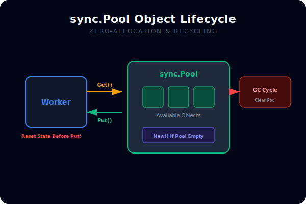
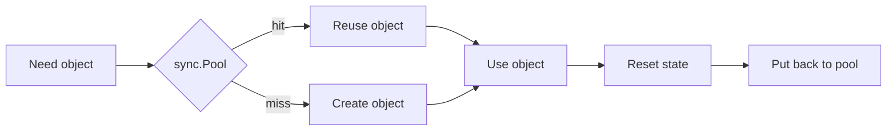

# CH-03: Zero-Allocation Patterns

## 1. Tahap 1: Source Alignment dan Judul

- **Source Link**: [sync.Pool](https://pkg.go.dev/sync#Pool) | [A Guide to the Go Garbage Collector](https://go.dev/doc/gc-guide)
- **Framing**: Zero-allocation bukan tujuan mutlak, tetapi penting saat jalur panas terlalu sering membuat objek baru dan memberi tekanan berlebih ke heap serta GC.

## 2. Tahap 2: Konsep dan Rasionalitas

### Definisi
Zero-allocation patterns adalah pendekatan untuk mengurangi atau menunda alokasi baru, misalnya lewat object reuse, buffer reuse, atau pemakaian `sync.Pool` pada jalur yang sensitif terhadap performa.

### Rasionalitas
Topik ini penting karena:

1. **GC pressure bisa turun**  
   Semakin sedikit objek singkat yang dibuat, semakin ringan kerja garbage collector.
2. **Latency di hot path bisa lebih stabil**  
   Jalur yang sering dipanggil tidak terus-menerus memicu alokasi baru.
3. **Engineer belajar membedakan optimisasi yang sehat dari yang berlebihan**  
   Tidak semua kode perlu nol alokasi, tetapi beberapa jalur memang pantas diberi perlakuan khusus.

### Analogi Model Mental
Bayangkan dapur restoran yang mencuci dan memakai ulang wadah prep yang sama untuk pesanan cepat, daripada terus membuka wadah baru untuk setiap langkah kecil.

### Terminologi Teknis
- **Object Reuse**: memakai ulang objek yang sudah ada daripada membuat baru.
- **GC Pressure**: beban tambahan pada garbage collector akibat banyak objek heap.
- **Hot Allocation Path**: jalur kode yang sangat sering membuat objek.

## 3. Tahap 3: Visualisasi Sistem

## 4. Tahap 4: Mekanisme Pembuktian

`sync.Pool` menyimpan objek sementara yang bisa dipakai ulang oleh goroutine lain. Ia bukan cache permanen, melainkan alat untuk meredam alokasi jangka pendek. Karena runtime bebas membuang isi pool saat GC, pola ini cocok untuk object reuse oportunistik, bukan untuk state yang wajib bertahan.

Nilai praktisnya:
- membantu mengurangi alokasi di jalur sibuk;
- cocok untuk buffer, scratch object, atau wrapper singkat;
- mengingatkan pembaca bahwa reuse selalu perlu disertai reset state yang aman.

## 5. Tahap 5: Lab Praktis

Lihat pembuktian di folder [examples/](./examples):
- [01-pool-benchmark](./examples/01-pool-benchmark) - Benchmark sederhana untuk melihat pengaruh object reuse terhadap pola alokasi.

---
*Status: [x] Complete*
