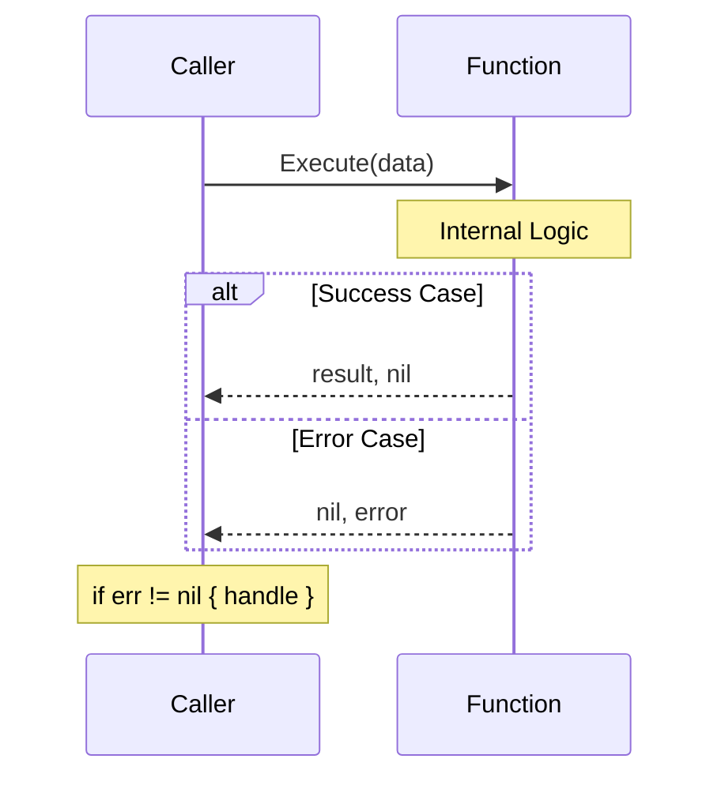

# CH-01: Explicit Error Handling (The Art of Checking)

> **Source Link**: [The Go Programming Language Specification - Errors](https://golang.org/ref/spec#Errors) | [Go Blog: Error handling and Go](https://blog.golang.org/error-handling-and-go)

## 1. Konsep & Esensi (Definisi & Rasionalitas)

### Definisi ("Apa itu?")
Di Go, error bukanlah sebuah "exception" yang menghentikan eksekusi secara paksa, melainkan sebuah **nilai (value)** yang dikembalikan oleh fungsi. Error diimplementasikan sebagai interface bawaan sederhana:
```go
type error interface {
    Error() string
}
```

### Rasionalitas ("Why & How?")
Go menghindari `try-catch` karena beberapa alasan fundamental:
1. **Control Flow Visibility**: Alur program menjadi eksplisit. Kita tahu persis di mana error bisa terjadi dan bagaimana ia ditangani.
2. **Performance**: Exception handling biasanya mahal karena melibatkan *stack unwinding*. Mengembalikan nilai error sangat murah.
3. **Simplicity**: Mengurangi kompleksitas bahasa dengan tidak menambahkan kata kunci baru untuk penanganan pengecualian.

### Analogi Model Mental
Bayangkan seorang **Kurir (Function)** yang mengantarkan paket. Bukannya berteriak kencang (Panic/Exception) saat ban kempes, sang kurir kembali ke kantor dan memberikan laporan tertulis (**Return Error Value**) bahwa pengiriman gagal karena ban bocor. Manajer (**Caller**) kemudian memutuskan apakah akan mengganti kurir atau melaporkannya ke pelanggan.

---

## 2. Visualisasi Sistem (Mermaid)



---

## 3. Mekanisme Pembuktian (Algoritma Detil)
Go Runtime tidak melakukan hal khusus untuk error handling selain memfasilitasi pengembalian multiple values. Namun, secara internal, pengecekan `if err != nil` adalah operasi cabang (branch) yang sangat efisien bagi CPU Branch Predictor karena pola ini sangat dominan dalam kode Go.

---

## 4. Lab Praktis (Examples)
Silakan tinjau folder [examples/](./examples) untuk eksperimen berikut:
- `01_basic_check.go`: Pola idiomatik `if err != nil`.
- `02_custom_error.go`: Membuat tipe error sendiri untuk informasi lebih detail.

---
*Unit ini memenuhi standar Platinum Gold (PPM V4).*
