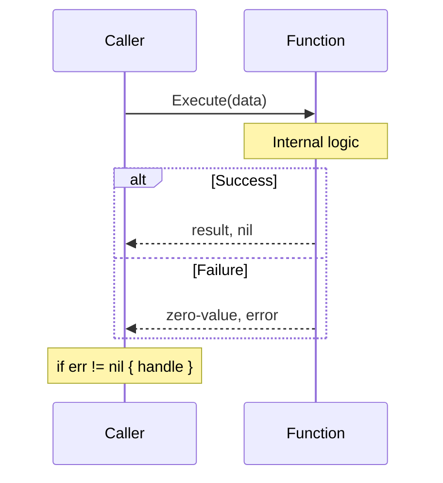

# CH-01: Explicit Error Handling

## 1. Tahap 1: Source Alignment dan Judul

- **Source Link**: [Go Specification: Errors](https://go.dev/ref/spec#Errors) | [Go Blog: Error handling and Go](https://go.dev/blog/error-handling-and-go)
- **Framing**: Di Go, error diperlakukan sebagai bagian dari alur program, bukan sebagai jalur rahasia yang tiba-tiba meledak di belakang layar.

## 2. Tahap 2: Konsep dan Rasionalitas

### Definisi
Di Go, error bukan exception yang otomatis memutus alur eksekusi, melainkan nilai yang dikembalikan oleh fungsi dan harus diperiksa secara eksplisit oleh pemanggil.

Secara bentuk, error dibangun di atas interface sederhana:

```go
type error interface {
    Error() string
}
```

### Rasionalitas
Go sengaja memilih model ini karena beberapa alasan utama:

1. **Alur program tetap terlihat**  
   Kita bisa melihat dengan jelas di mana kegagalan mungkin muncul dan bagaimana ia ditangani.
2. **Biaya mekanisme tetap ringan**  
   Model return value menjaga penanganan error tetap lurus dan murah dibanding model exception-style stack unwinding.
3. **Bahasa tetap sederhana**  
   Go tidak perlu menambah mekanisme khusus seperti `try-catch` untuk menangani kegagalan umum.

### Analogi Model Mental
Bayangkan seorang kurir yang gagal mengantar paket karena ban motornya bocor. Ia tidak langsung berteriak dan membuat seluruh kantor panik. Ia kembali sambil membawa laporan tertulis bahwa pengiriman gagal. Dari laporan itu, manajer bisa memutuskan langkah berikutnya. Di Go, laporan itu adalah nilai `error`.

### Terminologi Teknis
- **Error Value**: nilai yang merepresentasikan kegagalan dan dikembalikan oleh fungsi.
- **Caller-controlled Handling**: keputusan penanganan ada di pemanggil, bukan disembunyikan oleh mekanisme bahasa.
- **Explicit Control Flow**: penanganan error terlihat langsung di alur kode.

## 3. Tahap 3: Visualisasi Sistem



## 4. Tahap 4: Mekanisme Pembuktian

Di level implementasi, Go tidak memperlakukan error sebagai mekanisme sihir khusus. Error handling tetap berada di jalur return value biasa dan diproses sebagai percabangan normal di kode pemanggil.

Poin pentingnya bukan bahwa setiap `if err != nil` selalu “pasti lebih cepat” dalam semua situasi, tetapi bahwa desain ini:
- menjaga alur kode tetap mudah diikuti;
- tidak bergantung pada stack unwinding seperti exception model;
- selaras dengan filosofi Go yang memilih kejelasan dan kontrol eksplisit.

## 5. Tahap 5: Lab Praktis

Lihat pembuktian kode di folder [examples/](./examples):
- [01_basic_check.go](./examples/01_basic_check.go) - Pola idiomatik `if err != nil`.
- [02_custom_error.go](./examples/02_custom_error.go) - Membuat tipe error sendiri untuk konteks yang lebih kaya.

---
*Status: [x] Complete*
