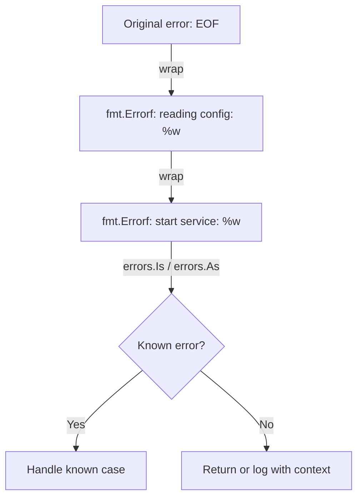

# CH-02: Error Wrapping and Inspection

## 1. Tahap 1: Source Alignment dan Judul

- **Source Link**: [Go Blog: Working with Errors in Go 1.13](https://go.dev/blog/go1.13-errors)
- **Framing**: Error wrapping di Go dipakai untuk menambah konteks tanpa membuang identitas error aslinya.

## 2. Tahap 2: Konsep dan Rasionalitas

### Definisi
Error wrapping adalah teknik membungkus error yang sudah ada dengan konteks baru, sambil tetap menjaga error asli agar masih bisa diperiksa secara programatik.

Salah satu bentuk yang paling umum adalah memakai `%w` di `fmt.Errorf`.

### Rasionalitas
Dalam sistem yang berlapis, error jarang berhenti di satu fungsi saja. Karena itu Go menyediakan cara untuk:

1. **Menambah konteks tanpa kehilangan asal error**  
   Kita tetap bisa tahu error ini muncul saat apa dan di lapisan mana.
2. **Melakukan pemeriksaan yang aman**  
   `errors.Is` dan `errors.As` membuat pemeriksaan error jadi lebih rapi daripada mengandalkan string matching atau type assertion kasar.
3. **Menjaga error chain tetap berguna**  
   Error bisa terus dibawa naik sambil tetap bisa ditelusuri.

### Analogi Model Mental
Bayangkan ada paket rusak ditemukan di gudang. Petugas gudang memasukkan paket itu ke kotak yang lebih besar lalu menempelkan label baru: “Rusak saat pemeriksaan gudang B”. Kantor pusat bisa membaca label luarnya, tapi kalau perlu tetap bisa membuka bungkus itu dan melihat masalah aslinya.

### Terminologi Teknis
- **Wrapping**: menambah konteks di atas error yang sudah ada.
- **Unwrap**: membuka satu lapisan pembungkus error.
- **Inspection**: memeriksa apakah rantai error mengandung jenis atau nilai tertentu.
- **Error Chain**: rangkaian error yang saling membungkus.

## 3. Tahap 3: Visualisasi Sistem

## 4. Tahap 4: Mekanisme Pembuktian

Secara internal, pemeriksaan error wrapping berjalan dengan menelusuri rantai error.

- `errors.Unwrap` mengambil satu lapisan error bila tipe tersebut menyediakan `Unwrap() error`.
- `errors.Is` berjalan menyusuri rantai untuk mencari kecocokan nilai atau sentinel error.
- `errors.As` menyusuri rantai untuk mencari tipe error tertentu dan menyalin hasilnya ke target yang diberikan.

Yang penting di level desain adalah: wrapping bukan sekadar menambah pesan, tetapi menjaga error tetap bisa dipahami oleh manusia dan mesin sekaligus.

## 5. Tahap 5: Lab Praktis

Lihat pembuktian kode di folder [examples/](./examples):
- [01_wrapping.go](./examples/01_wrapping.go) - Membungkus error dengan `%w` dan `fmt.Errorf`.
- [02_inspection.go](./examples/02_inspection.go) - Menggunakan `errors.Is` dan `errors.As` untuk inspection.

---
*Status: [x] Complete*
