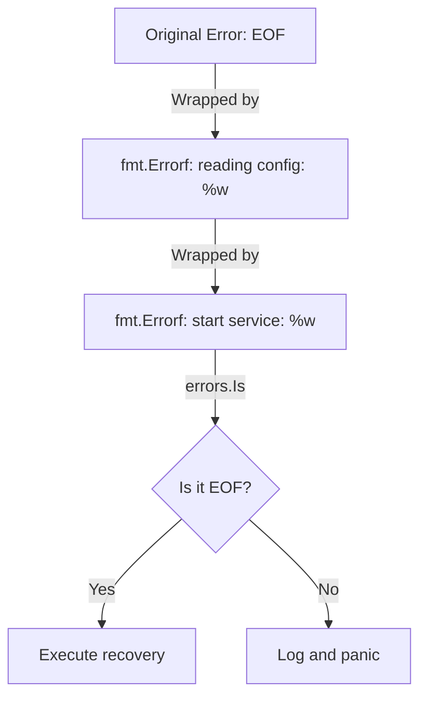

# CH-02: Error Wrapping & Inspection (The Modern Way)

> **Source Link**: [Go Blog: Working with Errors in Go 1.13](https://blog.golang.org/go1.13-errors)

## 1. Konsep & Esensi (Definisi & Rasionalitas)

### Definisi ("Apa itu?")
Error wrapping adalah mekanisme untuk menambahkan konteks pada error yang ada tanpa menghilangkan muatan (payload) error aslinya. Go menggunakan kata kunci `%w` dalam `fmt.Errorf` untuk membungkus error.

### Rasionalitas ("Why & How?")
Dalam sistem terdistribusi atau berjenjang:
1. **Traceability**: Mengetahui di mana error berasal dan jalur mana yang ia lewati.
2. **Programmatic Inspection**: Menggunakan `errors.Is` untuk membandingkan error dan `errors.As` untuk mengekstrak data dari error kustom tanpa harus melakukan tipe assertion manual yang berisiko.

### Analogi Model Mental
Bapak-bapak di gudang menemukan paket rusak. Ia memasukkan paket itu ke dalam kotak yang lebih besar (**Wrap**) dan menempelkan label "Kerusakan terdeteksi di Gudang B" sebelum mengirimnya ke kantor pusat. Kantor pusat bisa melihat label luar (**Context**), tapi tetap bisa membuka kotak untuk melihat paket aslinya (**Unwrap**) jika perlu.

---

## 2. Visualisasi Sistem (Mermaid)

---

## 3. Mekanisme Pembuktian (Algoritma Detil)
Secara internal, `errors.Unwrap` akan memanggil metode `Unwrap() error` jika tipenya memilikinya. Fungsi `errors.Is` dan `errors.As` melakukan traversal (penelusuran) ke dalam rantai error tersebut secara rekursif hingga menemukan kecocokan atau mencapai akhir rantai (`nil`).

---

## 4. Lab Praktis (Examples)
Silakan tinjau folder [examples/](./examples) untuk eksperimen berikut:
- `01_wrapping.go`: Menggunakan `%w` dan `fmt.Errorf`.
- `02_inspection.go`: Demonstrasi `errors.Is` dan `errors.As`.

---
*Unit ini memenuhi standar Platinum Gold (PPM V4).*
